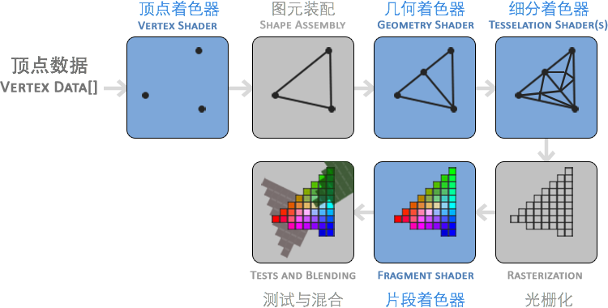

# 你好，三角形

原文     | [Creating a window](http://www.learnopengl.com/#!Getting-started/Hello-Triangle)
      ---|---
作者     | JoeyDeVries
翻译     | [Django](http://bullteacher.com/)
校对     | Geequlim

## 图形渲染管线(Pipeline)

在OpenGL中任何事物都在3D空间中，但是屏幕和窗口是一个2D像素阵列，所以OpenGL的大部分工作都是关于如何把3D坐标转变为适应你屏幕的2D像素。3D坐标转为2D坐标的处理过程是由OpenGL的**图形渲染管线**(Pipeline，大多译为管线，实际上指的是一堆原始图形数据途经一个输送管道，期间经过各种变化处理最终出现在屏幕的过程)管理的。图形渲染管线可以被划分为两个主要部分：第一个部分把你的3D坐标转换为2D坐标，第二部分是把2D坐标转变为实际的有颜色的像素。这个教程里，我们会简单地讨论一下图形渲染管线，以及如何使用它创建一些像素，这对我们来说是有好处的。

!!! Important

	2D坐标和像素也是不同的，2D坐标是在2D空间中的一个点的非常精确的表达，2D像素是这个点的近似值，它受到你的屏幕/窗口解析度的限制。

图形渲染管线接收一组3D坐标，然后把它们转变为你屏幕上的有色2D像素。图形渲染管线可以被划分为几个阶段，每个阶段需要把前一个阶段的输出作为输入。所有这些阶段都是高度专门化的(它们有一个特定的函数)，它们能简单地并行执行。由于它们的并行执行特性，当今大多数显卡都有成千上万的小处理核心，在GPU上为每一个(渲染管线)阶段运行各自的小程序，从而在图形渲染管线中快速处理你的数据。这些小程序叫做 **着色器**(Shader)。

有些着色器允许开发者自己配置，我们可以用自己写的着色器替换默认的。这样我们就可以更细致地控制图形渲染管线中的特定部分了，因为它们运行在GPU上，所以它们会节约宝贵的CPU时间。OpenGL着色器是用**OpenGL着色器语言**(OpenGL Shading Language, GLSL)写成的，我们在下一节会花更多时间研究它。

在下面，你会看到一个图形渲染管线的每个阶段的抽象表达。要注意蓝色部分代表的是我们可以自定义的着色器。



如你所见，图形渲染管线包含很多部分，每个都是将你的顶点数据转变为最后渲染出来的像素这个大过程中的一个特定阶段。我们会概括性地解释渲染管线的每个部分，从而使你对图形渲染管线的工作方式有个大概了解。

我们以数组的形式传递3个3D坐标作为图形渲染管线的输入，它用来表示一个三角形，这个数组叫做顶点数据(Vertex Data)；这里顶点数据是一些顶点的集合。一个**顶点**是一个3D坐标的集合(也就是x、y、z数据)。而顶点数据是用**顶点属性**(Vertex Attributes)表示的，它可以包含任何我们希望用的数据，但是简单起见，我们还是假定每个顶点只由一个3D位置([译注1])和几个颜色值组成的吧。

[译注1]: http://learnopengl-cn.readthedocs.org "译注:当我们谈论一个“位置”的时候，它代表在一个“空间”中所处地点的这个特殊属性；同时“空间”代表着任何一种坐标系，比如x、y、z三维坐标系，x、y二维坐标系，或者一条直线上的x和y的线性关系，只不过二维坐标系是一个扁扁的平面空间，而一条直线是一个很瘦的长长的空间。"

!!! Important

	为了让OpenGL知道我们的坐标和颜色值构成的到底是什么，OpenGL需要你去提示你希望这些数据所表示的是什么类型。我们是希望把这些数据渲染成一系列的点？一系列的三角形？还是仅仅是一个长长的线？做出的这些提示叫做**基本图形**(Primitives)，任何一个绘制命令的调用都必须把基本图形类型传递给OpenGL。这是其中的几个：**GL_POINTS**、**GL_TRIANGLES**、**GL_LINE_STRIP**。

图形渲染管线的第一个部分是**顶点着色器**(Vertex Shader)，它把一个单独的顶点作为输入。顶点着色器主要的目的是把3D坐标转为另一种3D坐标(后面会解释)，同时顶点着色器允许我们对顶点属性进行一些基本处理。

**基本图形装配**(Primitive Assembly)阶段把顶点着色器的表示为基本图形的所有顶点作为输入(如果选择的是`GL_POINTS`，那么就是一个单独顶点)，把所有点组装为特定的基本图形的形状；本节例子是一个三角形。

基本图形装配阶段的输出会传递给**几何着色器**(Geometry Shader)。几何着色器把基本图形形式的一系列顶点的集合作为输入，它可以通过产生新顶点构造出新的(或是其他的)基本图形来生成其他形状。例子中，它生成了另一个三角形。

**细分着色器**(Tessellation Shaders)拥有把给定基本图形**细分**为更多小基本图形的能力。这样我们就能在物体更接近玩家的时候通过创建更多的三角形的方式创建出更加平滑的视觉效果。

细分着色器的输出会进入**光栅化**(Rasterization也译为像素化)阶段，这里它会把基本图形映射为屏幕上相应的像素，生成供片段着色器(Fragment Shader)使用的片段(Fragment)。在片段着色器运行之前，会执行**裁切**(Clipping)。裁切会丢弃超出你的视图以外的那些像素，来提升执行效率。


!!! Important

	OpenGL中的一个fragment是OpenGL渲染一个独立像素所需的所有数据。

**片段着色器**的主要目的是计算一个像素的最终颜色，这也是OpenGL高级效果产生的地方。通常，片段着色器包含用来计算像素最终颜色的3D场景的一些数据(比如光照、阴影、光的颜色等等)。

在所有相应颜色值确定以后，最终它会传到另一个阶段，我们叫做**alpha测试**和**混合**(Blending)阶段。这个阶段检测像素的相应的深度(和Stencil)值(后面会讲)，使用这些，来检查这个像素是否在另一个物体的前面或后面，如此做到相应取舍。这个阶段也会检查**alpha值**(alpha值是一个物体的透明度值)和物体之间的**混合**(Blend)。所以，即使在片段着色器中计算出来了一个像素所输出的颜色，最后的像素颜色在渲染多个三角形的时候也可能完全不同。

正如你所见的那样，图形渲染管线非常复杂，它包含很多要配置的部分。然而，对于大多数场合，我们必须做的只是顶点和片段着色器。几何着色器和细分着色器是可选的，通常使用默认的着色器就行了。

在现代OpenGL中，我们**必须**定义至少一个顶点着色器和一个片段着色器(因为GPU中没有默认的顶点/片段着色器)。出于这个原因，开始学习现代OpenGL的时候非常困难，因为在你能够渲染自己的第一个三角形之前需要一大堆知识。本节结束就是你可以最终渲染出你的三角形的时候，你也会了解到很多图形编程知识。

## 顶点输入(Vertex Input)

开始绘制一些东西之前，我们必须给OpenGL输入一些顶点数据。OpenGL是一个3D图形库，所以我们在OpenGL中指定的所有坐标都是在3D坐标里(x、y和z)。OpenGL不是简单的把你所有的3D坐标变换为你屏幕上的2D像素；OpenGL只是在当它们的3个轴(x、y和z)在特定的-1.0到1.0的范围内时才处理3D坐标。所有在这个范围内的坐标叫做**标准化设备坐标**(Normalized Device Coordinates，NDC)会最终显示在你的屏幕上(所有出了这个范围的都不会显示)。

由于我们希望渲染一个三角形，我们指定所有的这三个顶点都有一个3D位置。我们把它们以`GLfloat`数组的方式定义为标准化设备坐标(也就是在OpenGL的可见区域)中。

```c++
GLfloat vertices[] = {
    -0.5f, -0.5f, 0.0f,
     0.5f, -0.5f, 0.0f,
     0.0f,  0.5f, 0.0f
};
```

由于OpenGL是在3D空间中工作的，我们渲染一个2D三角形，它的每个顶点都要有同一个z坐标0.0。在这样的方式中，三角形的每一处的深度(Depth, [译注2])都一样，从而使它看上去就像2D的。

[译注2]: http://learnopengl-cn.readthedocs.org "通常深度可以理解为z坐标，它代表一个像素在空间中和你的距离，如果离你远就可能被别的像素遮挡，你就看不到它了，它会被丢弃，以节省资源。"

!!! Important

	**标准化设备坐标(Normalized Device Coordinates, NDC)**

	一旦你的顶点坐标已经在顶点着色器中处理过，它们就应该是**标准化设备坐标**了，标准化设备坐标是一个x、y和z值在-1.0到1.0的一小段空间。任何落在范围外的坐标都会被丢弃/裁剪，不会显示在你的屏幕上。下面你会看到我们定义的在标准化设备坐标中的三角形(忽略z轴)：

    

	与通常的屏幕坐标不同，y轴正方向上的点和(0,0)坐标是这个图像的中心，而不是左上角。最后你希望所有(变换过的)坐标都在这个坐标空间中，否则它们就不可见了。

	你的标准化设备坐标接着会变换为**屏幕空间坐标**(Screen-space Coordinates)，这是使用你通过`glViewport`函数提供的数据，进行**视口变换**(Viewport Transform)完成的。最后的屏幕空间坐标被变换为像素输入到片段着色器。

有了这样的顶点数据，我们会把它作为输入数据发送给图形渲染管线的第一个处理阶段：顶点着色器。它会在GPU上创建储存空间用于储存我们的顶点数据，还要配置OpenGL如何解释这些内存，并且指定如何发送给显卡。顶点着色器接着会处理我们告诉它要处理内存中的顶点的数量。

我们通过**顶点缓冲对象**(Vertex Buffer Objects, VBO)管理这个内存，它会在GPU内存(通常被称为显存)中储存大批顶点。使用这些缓冲对象的好处是我们可以一次性的发送一大批数据到显卡上，而不是每个顶点发送一次。从CPU把数据发送到显卡相对较慢，所以无论何处我们都要尝试尽量一次性发送尽可能多的数据。当数据到了显卡内存中时，顶点着色器几乎立即就能获得顶点，这非常快。

顶点缓冲对象(VBO)是我们在OpenGL教程中第一个出现的OpenGL对象。就像OpenGL中的其他对象一样，这个缓冲有一个独一无二的ID，所以我们可以使用`glGenBuffers`函数生成一个缓冲ID：

```c++
GLuint VBO;
glGenBuffers(1, &VBO);  
```

OpenGL有很多缓冲对象类型，`GL_ARRAY_BUFFER`是其中一个顶点缓冲对象的缓冲类型。OpenGL允许我们同时绑定多个缓冲，只要它们是不同的缓冲类型。我们可以使用`glBindBuffer`函数把新创建的缓冲绑定到`GL_ARRAY_BUFFER`上：

```c++
glBindBuffer(GL_ARRAY_BUFFER, VBO);  
```

从这一刻起，我们使用的任何缓冲函数(在`GL_ARRAY_BUFFER`目标上)都会用来配置当前绑定的缓冲(`VBO`)。然后我们可以调用`glBufferData`函数，它会把之前定义的顶点数据复制到缓冲的内存中：

```c++
glBufferData(GL_ARRAY_BUFFER, sizeof(vertices), vertices, GL_STATIC_DRAW);
```

`glBufferData`是一个用来把用户定的义数据复制到当前绑定缓冲的函数。它的第一个参数是我们希望把数据复制到上面的缓冲类型：顶点缓冲对象当前绑定到`GL_ARRAY_BUFFER`目标上。第二个参数指定我们希望传递给缓冲的数据的大小(以字节为单位)；用一个简单的`sizeof`计算出顶点数据就行。第三个参数是我们希望发送的真实数据。

第四个参数指定了我们希望显卡如何管理给定的数据。有三种形式：

- `GL_STATIC_DRAW` ：数据不会或几乎不会改变。
- `GL_DYNAMIC_DRAW`：数据会被改变很多。
- `GL_STREAM_DRAW` ：数据每次绘制时都会改变。

三角形的位置数据不会改变，每次渲染调用时都保持原样，所以它使用的类型最好是`GL_STATIC_DRAW`。如果，比如，一个缓冲中的数据将频繁被改变，那么使用的类型就是`GL_DYNAMIC_DRAW`或`GL_STREAM_DRAW`。这样就能确保图形卡把数据放在高速写入的内存部分。

现在我们把顶点数据储存在显卡的内存中，用VBO顶点缓冲对象管理。下面我们会创建一个顶点和片段着色器，来处理这些数据。现在我们开始着手创建它们吧。

## 顶点着色器(Vertex Shader)

顶点着色器是几个着色器中的一个，它是可编程的。现代OpenGL需要我们至少设置一个顶点和一个片段着色器，如果我们打算做渲染的话。我们会简要介绍一下着色器以及配置两个非常简单的着色器来绘制我们第一个三角形。下个教程里我们会更详细的讨论着色器。

我们需要做的第一件事是用着色器语言GLSL写顶点着色器，然后编译这个着色器，这样我们就可以在应用中使用它了。下面你会看到一个非常基础的顶点着色器的源代码，它就是使用GLSL写的：

```c++
#version 330 core
  
layout (location = 0) in vec3 position;

void main()
{
    gl_Position = vec4(position.x, position.y, position.z, 1.0);
}
```

就像你所看到的那样，GLSL看起来很像C语言。每个着色器都起始于一个版本声明。这是因为OpenGL 3.3和更高的GLSL版本号要去匹配OpenGL的版本(GLSL420版本对应于OpenGL 4.2)。我们同样显式地表示我们会用核心模式(Core-profile)。

下一步，我们在顶点着色器中声明所有的输入顶点属性，使用in关键字。现在我们只关心位置(Position)数据，所以我们只需要一个顶点属性(Attribute)。GLSL有一个向量数据类型，它包含1到4个`float`元素，包含的数量可以从它的后缀看出来。由于每个顶点都有一个3D坐标，我们就创建一个`vec3`输入变量来表示位置(Position)。我们同样也指定输入变量的位置值(Location)，这是用`layout (location = 0)`来完成的，你后面会看到为什么我们会需要这个位置值。

!!! Important

	**向量(Vector)**

	在图形编程中我们经常会使用向量这个数学概念，因为它简明地表达了任意空间中位置和方向，二者是有用的数学属性。在GLSL中一个向量有最多4个元素，每个元素值都可以从各自代表一个空间坐标的`vec.x`、`vec.y`、`vec.z`和`vec.w`来获取到。注意`vec.w`元素不是用作表达空间中的位置的(我们处理的是3D不是4D)而是用在所谓透视划分(Perspective Division)上。我们会在后面的教程中更详细地讨论向量。

为了设置顶点着色器的输出，我们必须把位置数据赋值给预定义的`gl_Position`变量，这个位置数据是一个`vec4`类型的。在main函数的最后，无论我们给`gl_Position`设置成什么，它都会成为着色器的输出。由于我们的输入是一个3元素的向量，我们必须把它转换为4元素。我们可以通过把`vec3`数据作为`vec4`初始化构造器的参数，同时把`w`元素设置为`1.0f`(我们会在后面解释为什么)。

这个顶点着色器可能是能想到的最简单的了，因为我们什么都没有处理就把输入数据输出了。在真实的应用里输入数据通常都没有在标准化设备坐标中，所以我们首先就必须把它们放进OpenGL的可视区域内。

## 编译一个着色器

我们已经写了一个顶点着色器源码，但是为了OpenGL能够使用它，我们必须在运行时动态编译它的源码。

我们要做的第一件事是创建一个着色器对象，再次引用它的ID。所以我们储存这个顶点着色器为`GLuint`，然后用`glCreateShader`创建着色器：

```c++
GLuint vertexShader;
vertexShader = glCreateShader(GL_VERTEX_SHADER);
```

我们把着色器的类型提供`glCreateShader`作为它的参数。这里我们传递的参数是`GL_VERTEX_SHADER`这样就创建了一个顶点着色器。

下一步我们把这个着色器源码附加到着色器对象，然后编译它：

```c++
glShaderSource(vertexShader, 1, &vertexShaderSource, NULL);
glCompileShader(vertexShader);
```

`glShaderSource`函数把着色器对象作为第一个参数来编译它。第二参数指定了源码中有多少个**字符串**，这里只有一个。第三个参数是顶点着色器真正的源码，我们可以把第四个参数先设置为`NULL`。

!!! Important

	你可能会希望检测调用`glCompileShader`后是否编译成功了，是否要去修正错误。检测编译时错误的方法是：
	
		GLint success;
		GLchar infoLog[512];
		glGetShaderiv(vertexShader, GL_COMPILE_STATUS, &success);

	首先我们定义一个整型来表示是否成功编译，还需要一个储存错误消息的容器(如果有的话)。然后我们用`glGetShaderiv`检查是否编译成功了。如果编译失败，我们应该用`glGetShaderInfoLog`获取错误消息，然后打印它。

		if(!success)
		{
	    	glGetShaderInfoLog(vertexShader, 512, NULL, infoLog);
	    	std::cout << "ERROR::SHADER::VERTEX::COMPILATION_FAILED\n" << infoLog << std::endl;
		}

如果编译的时候没有任何错误，顶点着色器就被编译成功了。

## 片段着色器(Fragment Shader)

片段着色器是第二个也是最终我们打算创建的用于渲染三角形的着色器。片段着色器的全部，都是用来计算你的像素的最后颜色输出。为了让事情比较简单，我们的片段着色器只输出橘黄色。

!!! Important

	在计算机图形中颜色被表示为有4个元素的数组：红色、绿色、蓝色和alpha(透明度)元素，通常缩写为RGBA。当定义一个OpenGL或GLSL的颜色的时候，我们就把每个颜色的强度设置在0.0到1.0之间。比如，我们设置红色为1.0f，绿色为1.0f，这样这个混合色就是黄色了。这三种颜色元素的不同调配可以生成1600万不同颜色！

```c++
#version 330 core

out vec4 color;

void main()
{
    color = vec4(1.0f, 0.5f, 0.2f, 1.0f);
}
```

片段着色器只需要一个输出变量，这个变量是一个4元素表示的最终输出颜色的向量，我们可以自己计算出来。我们可以用`out`关键字声明输出变量，这里我们命名为`color`。下面，我们简单的把一个带有alpha值为1.0(1.0代表完全不透明)的橘黄的`vec4`赋值给`color`作为输出。

编译片段着色器的过程与顶点着色器相似，尽管这次我们使用`GL_FRAGMENT_SHADER`作为着色器类型：

```c++
GLuint fragmentShader;
fragmentShader = glCreateShader(GL_FRAGMENT_SHADER);
glShaderSource(fragmentShader, 1, &fragmentShaderSource, null);
glCompileShader(fragmentShader);
```

每个着色器现在都编译了，剩下的事情是把两个着色器对象链接到一个着色器程序中(Shader Program)，它是用来渲染的。

### 着色器程序

着色器程序对象(Shader Program Object)是多个着色器最后链接的版本。如果要使用刚才编译的着色器我们必须把它们链接为一个着色器程序对象，然后当渲染物体的时候激活这个着色器程序。激活了的着色器程序的着色器，在调用渲染函数时才可用。

把着色器链接为一个程序就等于把每个着色器的输出链接到下一个着色器的输入。如果你的输出和输入不匹配那么就会得到一个链接错误。

创建一个程序对象很简单：

```c++
GLuint shaderProgram;
shaderProgram = glCreateProgram();
```

`glCreateProgram`函数创建一个程序，返回新创建的程序对象的ID引用。现在我们需要把前面编译的着色器附加到程序对象上，然后用`glLinkProgram`链接它们：

```c++
glAttachShader(shaderProgram, vertexShader);
glAttachShader(shaderProgram, fragmentShader);
glLinkProgram(shaderProgram);
```

代码不言自明，我们把着色器附加到程序上，然后用`glLinkProgram`链接。

!!! Important

	就像着色器的编译一样，我们也可以检验链接着色器程序是否失败，获得相应的日志。与glGetShaderiv和glGetShaderInfoLog不同，现在我们使用：

		glGetProgramiv(shaderProgram, GL_LINK_STATUS, &success);
		if(!success) {
	    	glGetProgramInfoLog(shaderProgram, 512, NULL, infoLog);
	  	  ...
		}

我们可以调用`glUseProgram`函数，用新创建的程序对象作为它的参数，这样就能激活这个程序对象：

```c++
glUseProgram(shaderProgram);
```

现在在`glUseProgram`函数调用之后的每个着色器和渲染函数都会用到这个程序对象(当然还有这些链接的着色器)了。

在我们把着色器对象链接到程序对象以后，不要忘记删除着色器对象；我们不再需要它们了：

```c++
glDeleteShader(vertexShader);
glDeleteShader(fragmentShader);
```

现在，我们把输入顶点数据发送给GPU，指示GPU如何在顶点和片段着色器中处理它。还没结束，OpenGL还不知道如何解释内存中的顶点数据，以及怎样把顶点数据链接到顶点着色器的属性上。我们需要告诉OpenGL怎么做。

## 链接顶点属性

顶点着色器允许我们以任何我们想要的形式作为顶点属性(Vertex Attribute)的输入，同样它也具有很强的灵活性，这意味着我们必须手动指定我们的输入数据的哪一个部分对应顶点着色器的哪一个顶点属性。这意味着我们必须在渲染前指定OpenGL如何解释顶点数据。

我们的顶点缓冲数据被格式化为下面的形式：


- 位置数据被储存为32-bit(4 byte)浮点值。
- 每个位置包含3个这样的值。
- 在这3个值之间没有空隙(或其他值)。这几个值紧密排列为一个数组。
- 数据中第一个值是缓冲的开始位置。

有了这些信息我们就可以告诉OpenGL如何解释顶点数据了(每一个顶点属性)，我们使用`glVertexAttribPointer`这个函数：

```c++
glVertexAttribPointer(0, 3, GL_FLOAT, GL_FALSE, 3 * sizeof(GLfloat), (GLvoid*)0);
glEnableVertexAttribArray(0);
```

`glVertexAttribPointer`函数有很多参数，所以我们仔细来了解它们：

- 第一个参数指定我们要配置哪一个顶点属性。记住，我们在顶点着色器中使用`layout(location = 0)`定义了顶点属性——位置(Position)的位置值(Location)。这样要把顶点属性的位置值(Location)设置为0，因为我们希望把数据传递到这个顶点属性中，所以我们在这里填0。
- 第二个参数指定顶点属性的大小。顶点属性是`vec3`类型，它由3个数值组成。
- 第三个参数指定数据的类型，这里是`GL_FLOAT`(GLSL中`vec*`是由浮点数组成的)。
- 下个参数定义我们是否希望数据被标准化。如果我们设置为`GL_TRUE`，所有数据都会被映射到0(对于有符号型signed数据是-1)到1之间。我们把它设置为`GL_FALSE`。
- 第五个参数叫做步长(Stride)，它告诉我们在连续的顶点属性之间间隔有多少。由于下个位置数据在3个`GLfloat`后面的位置，我们把步长设置为`3 * sizeof(GLfloat)`。要注意的是由于我们知道这个数组是紧密排列的(在两个顶点属性之间没有空隙)我们也可以设置为0来让OpenGL决定具体步长是多少(只有当数值是紧密排列时才可用)。每当我们有更多的顶点属性，我们就必须小心地定义每个顶点属性之间的空间，我们在后面会看到更多的例子(译注: 这个参数的意思简单说就是从这个属性第二次出现的地方到整个数组0位置之间有多少字节)。
- 最后一个参数有奇怪的`GLvoid*`的强制类型转换。它表示我们的位置数据在缓冲中起始位置的偏移量。由于位置数据是数组的开始，所以这里是0。我们会在后面详细解释这个参数。

!!! Important

	每个顶点属性从VBO管理的内存中获得它的数据，它所获取数据的那个VBO，就是当调用`glVetexAttribPointer`的时候，最近绑定到`GL_ARRAY_BUFFER`的那个VBO。由于在调用`glVertexAttribPointer`之前绑定了VBO，顶点属性0现在链接到了它的顶点数据。

现在我们定义OpenGL如何解释顶点数据，我们也要开启顶点属性，使用`glEnableVertexAttribArray`，把顶点属性位置值作为它的参数；顶点属性默认是关闭的。自此，我们把每件事都做好了：我们使用一个顶点缓冲对象初始化了一个缓冲中的顶点数据，设置了一个顶点和片段着色器，告诉了OpenGL如何把顶点数据链接到顶点着色器的顶点属性上。在OpenGL绘制一个物体，看起来会像是这样：

```c++
// 0. 复制顶点数组到缓冲中提供给OpenGL使用
glBindBuffer(GL_ARRAY_BUFFER, VBO);
glBufferData(GL_ARRAY_BUFFER, sizeof(vertices), vertices, GL_STATIC_DRAW);
// 1. 设置顶点属性指针
glVertexAttribPointer(0, 3, GL_FLOAT, GL_FALSE, 3 * sizeof(GLfloat), (GLvoid*)0);
glEnableVertexAttribArray(0);  
// 2. 当我们打算渲染一个物体时要使用着色器程序
glUseProgram(shaderProgram);
// 3. 绘制物体
someOpenGLFunctionThatDrawsOurTriangle();
```

我们绘制一个物体的时候必须重复这件事。这看起来也不多，但是如果有超过5个顶点属性，100多个不同物体呢(这其实并不罕见)。绑定合适的缓冲对象，为每个物体配置所有顶点属性很快就变成一件麻烦事。有没有一些方法可以使我们把所有的配置储存在一个对象中，并且可以通过绑定这个对象来恢复状态？

### 顶点数组对象(Vertex Array Object, VAO)

**顶点数组对象(Vertex Array Object, VAO)**可以像顶点缓冲对象一样绑定，任何随后的顶点属性调用都会储存在这个VAO中。这有一个好处，当配置顶点属性指针时，你只用做一次，每次绘制一个物体的时候，我们绑定相应VAO就行了。切换不同顶点数据和属性配置就像绑定一个不同的VAO一样简单。所有状态我们都放到了VAO里。

!!! Attention

	OpenGL核心模式版要求我们使用VAO，这样它就能知道对我们的顶点输入做些什么。如果我们绑定VAO失败，OpenGL会拒绝绘制任何东西。

一个顶点数组对象储存下面的内容：

- 调用`glEnableVertexAttribArray`和`glDisableVertexAttribArray`。
- 使用`glVertexAttribPointer`的顶点属性配置。
- 使用`glVertexAttribPointer`进行的顶点缓冲对象与顶点属性链接。


生成一个VAO和生成VBO类似：

```c++
GLuint VAO;
glGenVertexArrays(1, &VAO);  
```

使用VAO要做的全部就是使用`glBindVertexArray`绑定VAO。自此我们就应该绑定/配置相应的VBO和属性指针，然后解绑VAO以备后用。当我们打算绘制一个物体的时候，我们只要在绘制物体前简单地把VAO绑定到希望用到的配置就行了。这段代码应该看起来像这样：

```c++
// ..:: 初始化代码 (一次完成 (除非你的物体频繁改变)) :: ..
 
// 1. 绑定VAO
glBindVertexArray(VAO);
 
// 2. 把顶点数组复制到缓冲中提供给OpenGL使用
glBindBuffer(GL_ARRAY_BUFFER, VBO);
glBufferData(GL_ARRAY_BUFFER, sizeof(vertices), vertices, GL_STATIC_DRAW);
 
// 3. 设置顶点属性指针
glVertexAttribPointer(0, 3, GL_FLOAT, GL_FALSE, 3 * sizeof(GLfloat), (GLvoid * )0);
glEnableVertexAttribArray(0);
 
//4. 解绑VAO
glBindVertexArray(0);
 
[...]
 
// ..:: 绘制代码 (in Game loop) :: ..
 
// 5. 绘制物体
glUseProgram(shaderProgram);
glBindVertexArray(VAO);
someOpenGLFunctionThatDrawsOurTriangle();
glBindVertexArray(0);
```

!!! Attention

	通常情况下当我们配置好它们以后要解绑OpenGL对象，这样我们才不会在某处错误地配置它们。

就是现在！前面做的一切都是等待这一刻，我们已经把我们的顶点属性配置和打算使用的VBO储存到一个VAO中。一般当你有多个物体打算绘制时，你首先要生成/配置所有的VAO(它需要VBO和属性指针)，然后储存它们准备后面使用。当我们打算绘制物体的时候就拿出相应的VAO，绑定它，绘制完物体后，再解绑VAO。

### 我们一直期待的三角形

OpenGL的`glDrawArrays`函数为我们提供了绘制物体的能力，它使用当前激活的着色器、前面定义的顶点属性配置和VBO的顶点数据(通过VAO间接绑定)来绘制基本图形。

```c++
glUseProgram(shaderProgram);
glBindVertexArray(VAO);
glDrawArrays(GL_TRIANGLES, 0, 3);
glBindVertexArray(0);  
```

`glDrawArrays`函数第一个参数是我们打算绘制的OpenGL基本图形的类型。由于我们在一开始时说过，我们希望绘制三角形，我们传递`GL_TRIANGLES`给它。第二个参数定义了我们打算绘制的那个顶点数组的起始位置的索引；我们这里填0。最后一个参数指定我们打算绘制多少个顶点，这里是3(我们只从我们的数据渲染一个三角形，它只有3个顶点)。

现在尝试编译代码，如果弹出了任何错误，回头检查你的代码。如果你编译通过了，你应该看到下面的结果：


完整的程序源码可以在[这里](http://learnopengl.com/code_viewer.php?code=getting-started/hellotriangle)找到。

如果你的输出和这个不一样，你可能做错了什么，去看源码，看看是否遗漏了什么东西或者在评论部分提问。

## 索引缓冲对象(Element Buffer Objects，EBO)

这是我们最后一件在渲染顶点这个问题上要讨论的事——索引缓冲对象简称EBO(或IBO)。解释索引缓冲对象的工作方式最好是举例子：假设我们不再绘制一个三角形而是矩形。我们就可以绘制两个三角形来组成一个矩形(OpenGL主要就是绘制三角形)。这会生成下面的顶点的集合：

```c++
GLfloat vertices[] = {
 
    // 第一个三角形
    0.5f, 0.5f, 0.0f,   // 右上角
    0.5f, -0.5f, 0.0f,  // 右下角
    -0.5f, 0.5f, 0.0f,  // 左上角
 
    // 第二个三角形
    0.5f, -0.5f, 0.0f,  // 右下角
    -0.5f, -0.5f, 0.0f, // 左下角
    -0.5f, 0.5f, 0.0f   // 左上角
};
```

就像你所看到的那样，有几个顶点叠加了。我们指定右下角和左上角两次！一个矩形只有4个而不是6个顶点，这样就产生50%的额外开销。当我们有超过1000个三角的模型这个问题会更糟糕，这会产生一大堆浪费。最好的解决方案就是每个顶点只储存一次，当我们打算绘制这些顶点的时候只调用顶点的索引。这种情况我们只要储存4个顶点就能绘制矩形了，我们只要指定我们打算绘制的那个顶点的索引就行了。如果OpenGL提供这个功能就好了，对吧？

很幸运，索引缓冲的工作方式正是这样的。一个EBO是一个像顶点缓冲对象(VBO)一样的缓冲，它专门储存索引，OpenGL调用这些顶点的索引来绘制。索引绘制正是这个问题的解决方案。我们先要定义(独一无二的)顶点，和绘制出矩形的索引：

```c++
GLfloat vertices[] = {
 
    0.5f, 0.5f, 0.0f,   // 右上角
    0.5f, -0.5f, 0.0f,  // 右下角
    -0.5f, -0.5f, 0.0f, // 左下角
    -0.5f, 0.5f, 0.0f   // 左上角
};
 
GLuint indices[] = { // 起始于0!
 
    0, 1, 3, // 第一个三角形
    1, 2, 3  // 第二个三角形
};
```

你可以看到，当时用索引的时候，我们只定义了4个顶点，而不是6个。下一步我们需要创建索引缓冲对象：

```c++
GLuint EBO;
glGenBuffers(1, &EBO);
```

与VBO相似，我们绑定EBO然后用`glBufferData`把索引复制到缓冲里。同样，和VBO相似，我们会把这些函数调用放在绑定和解绑函数调用之间，这次我们把缓冲的类型定义为`GL_ELEMENT_ARRAY_BUFFER`。

```c++
glBindBuffer(GL_ELEMENT_ARRAY_BUFFER, EBO);
glBufferData(GL_ELEMENT_ARRAY_BUFFER, sizeof(indices), indices, GL_STATIC_DRAW); 
```

要注意的是，我们现在用`GL_ELEMENT_ARRAY_BUFFER`当作缓冲目标。最后一件要做的事是用`glDrawElements`来替换`glDrawArrays`函数，来指明我们从索引缓冲渲染。当时用`glDrawElements`的时候，我们就会用当前绑定的索引缓冲进行绘制：

```c++
glBindBuffer(GL_ELEMENT_ARRAY_BUFFER, EBO);
glDrawElements(GL_TRIANGLES, 6, GL_UNSIGNED_INT, 0);
```

第一个参数指定了我们绘制的模式，这个和`glDrawArrays`的一样。第二个参数是我们打算绘制顶点的次数。我们填6，说明我们总共想绘制6个顶点。第三个参数是索引的类型，这里是`GL_UNSIGNED_INT`。最后一个参数里我们可以指定EBO中的偏移量(或者传递一个索引数组，但是这只是当你不是在使用索引缓冲对象的时候)，但是我们只打算在这里填写0。

`glDrawElements`函数从当前绑定到`GL_ELEMENT_ARRAY_BUFFER`目标的EBO获取索引。这意味着我们必须在每次要用索引渲染一个物体时绑定相应的EBO，这还是有点麻烦。不过顶点数组对象仍可以保存索引缓冲对象的绑定状态。VAO绑定之后可以索引缓冲对象，EBO就成为了VAO的索引缓冲对象。再次绑定VAO的同时也会自动绑定EBO。


!!! Attention

	当目标是`GL_ELEMENT_ARRAY_BUFFER`的时候，VAO储存了`glBindBuffer`的函数调用。这也意味着它也会储存解绑调用，所以确保你没有在解绑VAO之前解绑索引数组缓冲，否则就没有这个EBO配置了。

最后的初始化和绘制代码现在看起来像这样：

```c++
// ..:: 初始化代码 :: ..
// 1. 绑定VAO
glBindVertexArray(VAO);
 
// 2. 把我们的顶点数组复制到一个顶点缓冲中，提供给OpenGL使用
glBindBuffer(GL_ARRAY_BUFFER, VBO);
glBufferData(GL_ARRAY_BUFFER, sizeof(vertices), vertices, GL_STATIC_DRAW);
 
// 3. 复制我们的索引数组到一个索引缓冲中，提供给OpenGL使用
glBindBuffer(GL_ELEMENT_ARRAY_BUFFER, EBO);
glBufferData(GL_ELEMENT_ARRAY_BUFFER, sizeof(indices),indices, GL_STATIC_DRAW);
 
// 3. 设置顶点属性指针
glVertexAttribPointer(0, 3, GL_FLOAT, GL_FALSE, 3 * sizeof(GLfloat), (GLvoid * )0);
glEnableVertexAttribArray(0);
 
// 4. 解绑VAO，不解绑EBO(译注：解绑缓冲相当于没有绑定缓冲，可以在解绑VAO之后解绑缓冲)
glBindVertexArray(0);
 
[...]
 
// ..:: 绘制代码(在游戏循环中) :: ..
 
glUseProgram(shaderProgram);
glBindVertexArray(VAO);
glDrawElements(GL_TRIANGLES, 6, GL_UNSIGNED_INT, 0)
glBindVertexArray(0);
```

运行程序会获得下面这样的图片的结果。左侧图片看起来很熟悉，而右侧的则是使用线框模式(Wireframe Mode)绘制的。线框矩形可以显示出矩形的确是由两个三角形组成的。


!!! Important

	**线框模式(Wireframe Mode)**

	如果用线框模式绘制你的三角，你可以配置OpenGL绘制用的基本图形，调用`glPolygonMode(GL_FRONT_AND_BACK, GL_LINE)`。第一个参数说：我们打算应用到所有的三角形的前面和背面，第二个参数告诉我们用线来绘制。在随后的绘制函数调用后会一直以线框模式绘制三角形，直到我们用`glPolygonMode(GL_FRONT_AND_BACK, GL_FILL)`设置回了默认模式。

如果你遇到任何错误，回头检查代码，看看是否遗漏了什么。同时，你可以[在这里获得全部源码](http://learnopengl.com/code_viewer.php?code=getting-started/hellotriangle2)，也可以在评论区自由提问。

如果你绘制出了这个三角形或矩形，那么恭喜你，你成功地通过了现代OpenGL最难部分之一：绘制你自己的第一个三角形。这部分很难，因为在可以绘制第一个三角形之前需要很多知识。幸运的是我们现在已经越过了这个障碍，接下来的教程会比较容易理解一些。

## 附加资源

- [antongerdelan.net/hellotriangle](http://antongerdelan.net/opengl/hellotriangle.html): 一个渲染第一个三角形的教程。
- [open.gl/drawing](https://open.gl/drawing): Alexander Overvoorde的关于渲染第一个三角形的教程。
- [antongerdelan.net/vertexbuffers](http://antongerdelan.net/opengl/vertexbuffers.html): 顶点缓冲对象的一些深入探讨。

# 练习

为了更好的理解讨论的那些概念最好做点练习。建议在继续下面的主题之前做完这些练习，确保你对这些有比较好的理解。

- 尝试使用`glDrawArrays`以在你的数据中添加更多顶点的方式，绘制两个彼此相连的三角形：[参考解答](http://learnopengl.com/code_viewer.php?code=getting-started/hello-triangle-exercise1)
- 现在，使用不同的VAO(和VBO)创建同样的2个三角形，每个三角形的数据要不同(提示：创建2个顶点数据数组，而不是1个)：[参考解答](http://learnopengl.com/code_viewer.php?code=getting-started/hello-triangle-exercise2)
- 创建连个着色器程序(Shader Program)，第二个程序使用不同的片段着色器，它输出黄色；绘制这两个三角形，其中一个输出为黄色：[参考解答](http://learnopengl.com/code_viewer.php?code=getting-started/hello-triangle-exercise3)
