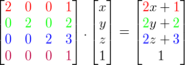

# 变换(Transformations)

原文     | [Transformations](http://learnopengl.com/#!Getting-started/Transformations)
      ---|---
作者     | JoeyDeVries
翻译     | Django
校对     | Meow J, [BLumia](https://github.com/blumia/)

尽管我们现在已经知道了如何创建一个物体、着色、加入纹理从而给它们一些细节的表现，但是它们仍然还是不够有趣，因为它们都还是静态的物体。我们可以尝试着在每一帧改变物体的顶点并且重设缓冲区从而使他们移动，但这太繁琐了，而且会消耗很多的处理时间。然而，我们现在有一个更好的解决方案，使用(多个)矩阵(Matrix)对象可以更好的变换(Transform)一个物体。当然，这并不是说我们会去讨论武术和数字虚拟世界(译注：Matrix同样也是电影「黑客帝国」的英文名，电影中人类生活在数字虚拟世界，主角会武术)。

**矩阵**(Matrix)是一种非常有用的数学工具，尽管听起来可能有些吓人，不过一旦你理解了它们后，它们会非常有用。在讨论矩阵的过程中，我们需要使用到一些数学知识。对于一些愿意多了解这些知识的读者，我会附加一些资源给你们阅读。

为了深入了解变换，我们首先要在讨论矩阵之前了解一点向量(Vector)。这一节的目标是让你拥有将来需要的最基础的数学背景知识. 如果你发现这节十分困难，尽量尝试去理解它们，当你以后需要它们的时候回过头来复习这些概念。

## 向量(Vector)

向量最最基本的定义就是一个方向。或者更正式的说，向量有一个**方向(Direction)**和**大小(Magnitude，也叫做强度或长度)**。你可以把向量想成一个藏宝图上的指示：“向左走10步，向北走3步，然后向右走5步”；“左”就是方向，“10步”就是向量的长度。你可以发现，这个藏宝图的指示一共有3个向量。向量可以在任意**维度**(Dimension)上，但是我们通常只使用2至4维。如果一个向量有2个维度，它表示一个平面的方向(想象一下2D的图像)，当它有3个维度的时候它可以表达一个3D世界的方向。

下面你会看到3个向量，每个向量在图像中都用一个箭头(x, y)表示。我们在2D图片中展示这些向量，因为这样子会更直观. 你仍然可以把这些2D向量当做z坐标为0的3D向量。由于向量表示的是方向，起始于何处**并不会**改变它的值。下图我们可以看到向量\(\color{red}{\bar{v}}\)和\(\color{blue}{\bar{w}}\)是相等的，尽管他们的起始点不同：


数学家喜欢在字母上面加一横表示向量，比如说。当用在公式中时它们通常是这样的：

$$
\bar{v} = \begin{pmatrix} \color{red}x \\ \color{green}y \\ \color{blue}z \end{pmatrix}
$$

由于向量是一个方向，所以有些时候会很难形象地将它们用位置(Position)表示出来。我们通常设定这个方向的原点为(0,0,0)，然后指向对应坐标的点，使其变为**位置向量(Position Vector)**来表示(你也可以把起点设置为其他的点，然后说：这个向量从这个点起始指向另一个点)。位置向量(3, 5)的在图像中起点是(0, 0)，指向(3, 5)。我们可以使用向量在2D或3D空间中表示方向**与**位置.

和普通数字一样，我们也可以用向量进行多种运算(其中一些你可能已经知道了)。

### 向量与标量运算(Scalar Vector Operations)

**标量(Scalar)**只是一个数字(或者说是仅有一个分量的矢量)。当把一个向量加/减/乘/除一个标量，我们可以简单的把向量的每个分量分别进行该运算。对于加法来说会像这样:


其中的+可以是+，-，·或÷，其中·是乘号。注意－和÷运算时不能颠倒，因为颠倒的运算是没有定义的(标量-/÷矢量)

### 向量取反(Vector Negation)

对一个向量取反会将其方向逆转。一个指向东北的向量取反后就指向西南方向了。我们在一个向量的每个分量前加负号就可以实现取反了(或者说用-1数乘该向量):


### 向量加减

向量的加法可以被定义为是**分量的(Component-wise)**相加，即将一个向量中的每一个分量加上另一个向量的对应分量：


向量v = (4, 2)和k = (1, 2)直观地表示为：


就像普通数字的加减一样，向量的减法等于加上第二个向量的相反数：


两个向量的相减会得到这两个向量指向位置的差. 这在我们想要获取两点的差会非常有用.


### 长度(Length)

我们使用**勾股定理(Pythagoras Theorem)**来获取向量的长度/大小. 如果你把向量的x与y分量画出来，该向量会形成一个以x与y分量为边的三角形:


因为两条边(x和y)是已知的，而且我们希望知道斜边的长度，所以我们可以通过勾股定理来计算出它:


表示向量的大小，我们也可以很容易加上把这个公式拓展到三维空间

例子中向量(4, 2)的长度等于：


结果是4.47。

有一个特殊类型向量叫做**单位向量(Unit Vector)**。单位向量有一个特别的性质——它的长度是1。我们可以用任意向量的每个分量除以向量的长度得到它的单位向量：


我们把这种方法叫做一个向量的**标准化(Normalizing)**。单位向量头上有一个^样子的记号，并且它会变得很有用，特别是在我们只关心方向不关系长度的时候(如果我们改变向量的长度，它的方向并不会改变)。

### 向量相乘(Vector-vector Multiplication)

两个向量相乘是一种很奇怪的情况。普通的乘法在向量上是没有定义的，因为它在视觉上是没有意义的，但是有两种特定情境，当需要乘法时我们可以从中选择：一个是**点乘(Dot Product)**，记作，另一个是**叉乘(Cross Product)**，记作。

#### 点乘(Dot Product)

两个向量的点乘等于它们的数乘结果乘以两个向量之间夹角的余弦值。听起来有点费解，先看一下公式：


它们之间的夹角我们记作。为什么这很有用？想象如果和都是单位向量，它们的长度等于1。公式会有效简化成：


现在点乘**只**和两个向量的角度有关。你也许记得当90度的余弦是0，0度的余弦是1。使用点乘可以很容易测试两个向量是否正交(Orthogonal)或平行(正交意味着两个向量互为**直角**)。你可能想要了解更多的关于正弦或余弦的知识，我推荐你看[可汗学院](https://www.khanacademy.org/math/trigonometry/basic-trigonometry/basic_trig_ratios/v/basic-trigonometry)的基础三角学视频。

!!! Important

	你可以通过点乘的结果计算两个非单位向量的夹角，点乘的结果除以两个向量的大小之积，得到的结果就是夹角的余弦值，即。

	译注：通过上面点乘定义式可推出：

	

所以，我们如何计算点乘？点乘是按分量逐个相乘，然后再把结果相加。两个单位向量点乘就像这样(你可以用两个长度为1的验证)：


计算两个单位余弦的角度，我们使用反余弦 ，结果是143.1度。现在我们很快就计算出了两个向量的角度。点乘在计算光照的时候会很有用。

#### 叉乘(Cross Product)

叉乘只在3D空间有定义，它需要两个不平行向量作为输入，生成正交于两个输入向量的第三个向量。如果输入的两个向量也是正交的，那么叉乘的结果将会返回3个互相正交的向量。接下来的教程中，这很有用。下面的图片展示了3D空间中叉乘的样子：


不同于其他运算，如果你没有钻研过线性代数，会觉得叉乘很反直觉，所以最好记住公式，就没问题(记不住也没问题)。下面你会看到两个正交向量A和B叉乘结果：


就像你所看到的，看起来毫无头绪。可如果你这么做了，你会得到第三个向量，它正交于你的输入向量。

## 矩阵(Matrix)

现在我们已经讨论了向量的全部内容，是时候看看矩阵了！矩阵简单说是一个矩形的数字、符号或表达式数组。矩阵中每一项叫做矩阵的**元素(Element)**。下面是一个2×3矩阵的例子：


矩阵可以通过(i, j)进行索引，i是行，j是列，这就是上面的矩阵叫做2×3矩阵的原因(3列2行，也叫做矩阵的**维度(Dimension)**)。这与你在索引2D图像时的(x, y)相反，获取4的索引是(2, 1)(第二行，第一列)(译注：如果是图像索引应该是(1, 2)，先算列，再算行)。

关于矩阵基本也就是这些了，它就是矩形数学表达式阵列。矩阵也有非常漂亮的数学属性，就跟向量一样。矩阵有几个运算，叫做：矩阵加法、减法和乘法。

### 矩阵的加减

矩阵与标量的加减如下所示：


标量值要加到矩阵的每一个元素上。矩阵与标量的减法也是同样的：


矩阵与矩阵之间的加减就是两个矩阵对应元素的加减运算，所以总体的规则和与标量运算是差不多的，只不过在相同索引下的元素才能进行运算。这也就是说加法和减法只在同维度的矩阵中是有定义的。一个3×2矩阵和一个2×3矩阵(或一个3×3矩阵与4×4矩阵)是不能进行加减的。我们看看两个2×2矩阵是怎样加减的：


同样的法则也适用于减法：


### 矩阵的数乘(Matrix-scalar Products)

和矩阵与标量的加减一样，矩阵与标量之间的乘法也是矩阵的每一个元素分别乘以该标量。下面的例子展示了乘法的过程：


现在我们也就能明白为什么一个单独的数字要叫做标量(Scalar)了。简单来说，标量就是用它的值缩放(Scale)矩阵的所有元素(译注：注意Scalar是由Scale + -ar演变过来的)。前面的例子里，所有的元素都被放大了2倍。

到目前为止都还好，我们的例子都不复杂。不过矩阵与矩阵的乘法就不一样了。

### 矩阵相乘(Matrix-matrix Multiplication)

矩阵之间的乘法不见得有多复杂，但的确很难让人适应。矩阵乘法基本上意味着遵照规定好的法则进行相乘。当然，相乘还有一些限制：

1. 只有当左侧矩阵的列数与右侧矩阵的行数相等，两个矩阵才能相乘。
2. 矩阵相乘不遵守**交换律(Commutative)**，。

我们先看一个两个2×2矩阵相乘的例子：


现在你可能会在想了：我勒个去，刚刚到底发生了什么? 矩阵的乘法是一系列乘法和加法组合的结果，它使用到了左侧矩阵的行和右侧矩阵的列。我们可以看下面的图片：


我们先把左侧矩阵的行和右侧矩阵的列拿出来。这些我们挑出来行和列决定着作为结果的2×2矩阵的输出值。如果我们拿出来的是左矩阵的第一行，最终的值就会出现在作为结果的矩阵的第一行，如果我们拿出来的是右矩阵的第一列，最终值会出现在作为结果的矩阵的第一列。这正是红框里的情况。如果想计算结果矩阵右下角的值，我们要用第一个矩阵的第二行和第二个矩阵的第二列(译注：简单来说就是结果矩阵的元素的行取决于第一个矩阵，列取决于第二个矩阵)。

计算一项的结果值的方式是先计算左侧矩阵对应行和右侧矩阵对应列的第一个元素之积，然后是第二个，第三个，第四个等等，然后把所有的乘积相加，这就是结果了。现在我们就能解释为什么左侧矩阵的列数必须和右侧矩阵的行数相等了，如果不相等这一步的操作我们就无法完成了!

结果的矩阵的维度是(n, m)，n等于左侧矩阵的行数，m等于右侧矩阵的列数。

如果你在脑子里想象出乘法有困难别担心。用笔写下来，如果遇到困难回头看这页的内容。随着时间流逝，矩阵乘法对你来说会变成很自然的事。

我们用一个更大的例子来结束矩阵与矩阵乘法的讨论。尝试使用颜色来让这个公式更容易理解。作为一个有用的练习，你可以自己回答这个乘法问题然后对比你的结果和图中的这个(如果你用笔计算，你很快就能掌握它们)。


就像你所看到的那样，矩阵与矩阵相乘复杂而容易犯错(这就是我们通常让计算机做这件事的原因)，而且当矩阵变大以后很快就会出现问题。如果你仍然希望了解更多，对矩阵的数学属性感到好奇，我强烈推荐你看看[可汗学院](https://www.khanacademy.org/math/algebra2/algebra-matrices)的矩阵内容视频。

不管怎样，反正现在我们知道如何进行矩阵相乘了，我们可以开始了解好东西了。

## 矩阵与向量相乘

到目前，通过这些教程我们已经相当了解向量了。我们用向量来表示位置、颜色和纹理坐标。让我们进到兔子洞更深处：向量基本上就是一个**N×1**矩阵，N是向量分量的个数(也叫**N维(N-dimensional)**向量)。如果你仔细思考这个问题，会很有意思。向量和矩阵一样都是一个数字序列，但是它只有1列。所以，这个新信息能如何帮助我们？如果我们有一个M×N矩阵，我们可以用这个矩阵乘以我们的N×1向量，因为我们的矩阵的列数等于向量的行数，所以它们就能相乘。

但是为什么我们关心矩阵是否能够乘以一个向量？有很多有意思的2D/3D变换本质上都是矩阵，而矩阵与我们的向量相乘会变换我们的向量。假如你仍然有些困惑，我们看一些例子，你很快就能明白了。

### 单位矩阵(Identity Matrix)

在OpenGL中，因为有一些原因我们通常使用4×4的变换矩阵，而其中最重要的原因就是因为每一个向量都有4个分量的。我们能想到的最简单的变换矩阵就是**单位矩阵(Identity Matrix)**。单位矩阵是一个除了对角线以外都是0的N × N矩阵。就像你看到的，这个变换矩阵使一个向量完全不变：


向量看起来完全没动。从乘法法则来看很明显：第一个结果分量是矩阵的第一行的每个对应分量乘以向量的每一个分量。因为每行的分量除了第一个都是0，可得: ，这对向量的其他3个分量同样适用。

!!! Important

	你可能会奇怪一个没变换的变换矩阵有什么用？单位矩阵通常是生成其他变换矩阵的起点，如果我们深挖线性代数，这就是一个对证明定理、解线性方程非常有用的矩阵。

### 缩放(Scaling)

当我们对一个向量进行缩放的时候就是对向量的长度进行缩放，而它的方向保持不变。如果我们进行2或3维操作，那么我们可以分别定义一个有2或3个缩放变量的向量，每个变量缩放一个轴(x、y或z)。

我们可以尝试去缩放向量。我们可以把向量沿着x轴缩放0.5，使它的宽度缩小为原来的二分之一；我们可以沿着y轴把向量的高度缩放为原来的两倍。我们看看把向量缩放(0.5, 2)所获得的是什么样的：


记住，OpenGL通常是在3D空间操作的，对于2D的情况我们可以把z轴缩放1这样z轴的值就不变了。我们刚刚的缩放操作是**不均匀(Non-uniform)**缩放，因为每个轴的缩放因子(Scaling Factor)都不一样。如果每个轴的缩放都一样那么就叫**均匀缩放(Uniform Scale)**。

我们下面设置一个变换矩阵来为我们提供缩放功能。我们从单位矩阵了解到，每个对角线元素乘以对应的向量分量。如果我们把1变为3会怎样？这种情况，我们就把向量的每个分量乘以3了，这事实上就把向量缩放3。如果我们把缩放变量表示为我们可以为任意向量(x, y, z)定义一个缩放矩阵：


注意，第四个缩放的向量仍然是1，因为不会缩放3D空间中的w分量。w分量另有其他用途，在后面我们会看到。

### 平移(Translation)

**平移(Translation)**是在原来向量的基础上加上另一个的向量从而获得一个在不同位置的新向量的过程，这样就基于平移向量**移动(Move)**了向量。我们已经讨论了向量加法，所以你应该不会陌生。

和缩放矩阵一样，在4×4矩阵上有几个特别的位置用来执行特定的操作，对于平移来说它们是第四列最上面的3个值。如果我们把缩放向量表示为我们就能把平移矩阵定义为:


这样是能工作的，因为所有的平移值都要乘以向量的w列，所以平移值会加到向量的原始坐标上(想想矩阵乘法法则)。而如果你用3x3矩阵我们的平移值就没地方放也没地方乘了，所以是不行的。

!!! Important

	**齐次坐标(Homogeneous coordinates)**

	向量的w分量也叫**齐次坐标**。想要从齐次坐标得到3D坐标，我们可以把x、y和z坐标除以w坐标。我们通常不会注意这个问题，因为w分量通常是1.0。使用齐次坐标有几点好处：它允许我们在3D向量上进行平移(如果没有w分量我们是不能平移向量的)，下一章我们会用w值创建3D图像。
	
	如果一个向量的齐次坐标是0，这个坐标就是**方向向量(Direction Vector)**，因为w坐标是0，这个向量就不能平移(译注:这也就是我们说的不能平移一个方向)。

有了平移矩阵我们就可以在3个方向(x、y、z)上移动物体，它是我们的变换工具箱中非常有用的一个变换矩阵。

### 旋转(Rotation)

上面几个的变换内容相对容易理解，在2D或3D空间中也容易表示出来，但旋转稍复杂些。如果你想知道旋转矩阵是如何构造出来的，我推荐你去看可汗学院[线性代数](https://www.khanacademy.org/math/linear-algebra/matrix_transformations)视频。

首先我们来定义一个向量的旋转到底是什么。2D或3D空间中点的旋转用**角(Angle)**来表示。角可以是角度制或弧度制的，周角是360度或2 [PI](https://en.wikipedia.org/wiki/Pi)弧度。我个人更喜欢用角度，因为它们看起来更直观。

!!! Important

	大多数旋转函数需要用弧度制的角，但是角度制的角也可以很容易地转化为弧度制：
	
	- 弧度转角度：角度 = 弧度 * (180.0f / PI)
	- 角度转弧度：弧度 = 角度 * (PI / 180.0f)
	
	PI约等于3.14159265359。

转半圈会向右旋转360/2 = 180度，向右旋转1/5圈表示向右旋转360/5 = 72度。这表明2D空间的向量是由向右旋转72度得到的：


在3D空间中旋转需要一个角**和**一个**旋转轴(Rotation Axis)**。物体会沿着给定的旋转轴旋转特定角度。如果你想要更形象化的描述，可以试试向下看着一个特定的旋转轴，同时将你的头部旋转一定角度。比如2D向量在3D空间中旋转时，我们把旋转轴设为z轴(尝试想象这种情况)。

使用三角学就能把一个向量变换为一个经过旋转特定角度的新向量。这通常是使用一系列正弦和余弦各种巧妙的组合得到的(一般简称sin和cos)。当然，讨论如何生成变换矩阵超出了这个教程的范围。

旋转矩阵在3D空间中每个单位轴都有不同定义，这个角度表示为：

沿x轴旋转：


沿y轴旋转：


沿z轴旋转：


利用旋转矩阵我们可以把我们的位置向量(Position Vectors)沿一个或多个轴进行旋转。也可以把多个矩阵结合起来，比如先沿着X轴旋转再沿着Y轴旋转。但是这会很快导致一个问题——**万向节死锁(Gimbal Lock，可以看看[这个视频](https://www.youtube.com/watch?v=zc8b2Jo7mno)[（优酷）](http://v.youku.com/v_show/id_XNzkyOTIyMTI=.html)来了解)**。我们不会讨论它的细节，但是一个更好的解决方案是沿着任意轴比如(0.662, 0.2, 0.7222)(注意，这是个单位向量)旋转，而不是使用一系列旋转矩阵的组合。这样一个(超级麻烦)的矩阵是存在的，下面代表任意旋转轴：


在数学上讨论如何生成这样的矩阵仍然超出了本节内容。但是记住，即使这样一个矩阵也不能完全解决万向节死锁问题(尽管会极大地避免)。避免万向节死锁的真正解决方案是使用**四元数(Quaternion)**，它不仅安全，而且计算更加友好。有关四元数会在后面的教程中讨论。

### 矩阵的组合

使用矩阵变换的真正力量在于，根据矩阵之前的乘法，我们可以把多个变换组合到一个矩阵中。让我们看看我们是否能生成一个多个变换相结合而成的变换矩阵。我们有一个顶点(x, y, z)，我们希望将其缩放2倍，然后用位移(1, 2, 3)来平移它。我们需要一个平移和缩放矩阵来完成这些变换。结果的变换矩阵看起来像这样：


注意，当矩阵相乘时我们先写平移再写缩放变换的。矩阵乘法是不可交换的，这意味着它们的顺序很重要。当矩阵相乘时，在最右边的矩阵是第一个乘以向量的，所以你应该从右向左读这个乘法。我们建议您在组合矩阵时，先进行缩放操作，然后是旋转，最后才是平移，否则它们会(消极地)互相影响。比如，如果你先平移然后缩放，平移的向量也会同样被缩放(译注：比如向某方向移动2米，2米也许会被缩放成1米)！

将我们的矢量左乘最终的变换矩阵会得到以下结果：



不错！向量先缩放2倍，然后平移了(1, 2, 3)个单位。

## 实践

现在我们已经解释了所有变换背后的理论，是时候将这些知识利用起来了。OpenGL没有任何自带的矩阵和向量形式，所以我们必须自己定义数学类和方法。在这个教程中我们更愿意抽象所有的数学细节，使用已经做好了的数学库。幸运的是有个使用简单的专门为OpenGL量身定做的数学库，那就是GLM。

### GLM

GLM是Open**GL** **M**athematics的缩写，它是一个只有头文件的库，也就是说我们只需包含合适的头文件就行了；不用链接和编译。GLM可以从他们的[网站](http://glm.g-truc.net/0.9.5/index.html)上下载。把头文件的根目录复制到你的`includes`文件夹，然后你就可以使用这个库了。


我们需要的GLM的大多数功能都可以从下面这3个头文件中找到：

```c++
#include <glm/glm.hpp>
#include <glm/gtc/matrix_transform.hpp>
#include <glm/gtc/type_ptr.hpp>
```

我们来看看是否可以利用我们刚学的变换知识把一个向量(1, 0, 0)平移(1, 1, 0)个单位(注意，我们把它定义为一个glm::vec4类型的值，其中齐次坐标我们设定为1.0)：

```c++
glm::vec4 vec(1.0f, 0.0f, 0.0f, 1.0f);
glm::mat4 trans;
trans = glm::translate(trans, glm::vec3(1.0f, 1.0f, 0.0f));
vec = trans * vec;
std::cout << vec.x << vec.y << vec.z << std::endl;
```

我们先用GLM内建的向量类定义一个叫做`vec`的向量。接下来我们定义一个`mat4`类型的`trans`，默认是4×4单位矩阵。接下来我们创建一个变换矩阵，我们是把单位矩阵和一个平移向量传递给`glm::translate`函数来完成这个工作的(然后用给定的矩阵乘以平移矩阵就能获得最后需要的矩阵)。

之后我们把向量乘以平移矩阵并且输出最后的结果。如果我们仍然记得平移矩阵是如何工作的话，得到的向量应该是(1 + 1, 0 + 1, 0 + 0)，也就是(2, 1, 0)。这个代码片段将会输出210，所以这个平移矩阵是正确的。

我们来做些更有意思的事情，让我们来旋转和缩放之前教程中的那个箱子。首先我们把箱子逆时针旋转90度。然后缩放0.5倍，使它变成原来的二分之一。我们先来创建变换矩阵：

```c++
glm::mat4 trans;
trans = glm::rotate(trans, 90.0f, glm::vec3(0.0, 0.0, 1.0));
trans = glm::scale(trans, glm::vec3(0.5, 0.5, 0.5));  
```

首先，我们把箱子在每个轴缩放到0.5倍，然后沿Z轴旋转90度。注意有纹理的那面矩形是在XY平面上的，我们需要把它绕着z轴旋转。因为我们把这个矩阵传递给了GLM的每个函数，GLM会自动将矩阵相乘，返回的结果是一个包括了多个变换的变换矩阵。

!!! Attention

	有些GLM版本接收的是弧度而不是角度，这种情况下你可以用`glm::radians(90.0f)`将角度转换为弧度。

下一个大问题是：如何把矩阵传递给着色器？我们在前面简单提到过GLSL里的`mat4`类型。所以我们改写顶点着色器来接收一个`mat4`的uniform变量，然后再用矩阵uniform乘以位置向量：

```c++
#version 330 core
layout (location = 0) in vec3 position;
layout (location = 1) in vec3 color;
layout (location = 2) in vec2 texCoord;

out vec3 ourColor;
out vec2 TexCoord;
  
uniform mat4 transform;

void main()
{
    gl_Position = transform * vec4(position, 1.0f);
    ourColor = color;
    TexCoord = vec2(texCoord.x, 1.0 - texCoord.y);
} 
```

!!! Attention

	GLSL也有`mat2`和`mat3`类型从而允许了像向量一样的混合运算。前面提到的所有数学运算(比如标量-矩阵乘法，矩阵-向量乘法和矩阵-矩阵乘法)在矩阵类型里都可以使用。当出现特殊的矩阵运算的时候我们会特别说明发生了什么的。

在把位置向量传给`gl_Position`之前，我们添加一个uniform，并且用变换矩阵乘以它。我们的箱子现在应该是原来的二分之一大小并旋转了90度(向左倾斜)。当然，我们仍需要把变换矩阵传递给着色器：

```c++
GLuint transformLoc = glGetUniformLocation(ourShader.Program, "transform");
glUniformMatrix4fv(transformLoc, 1, GL_FALSE, glm::value_ptr(trans));
```

我们首先请求uniform变量的地址，然后用有`Matrix4fv`后缀的`glUniform`函数把矩阵数据发送给着色器。第一个参数你现在应该很熟悉了，它是uniform的地址(Location)。第二个参数告诉OpenGL我们将要发送多少个矩阵，目前是1。第三个参数询问我们我们是否希望对我们的矩阵进行置换(Transpose)，也就是说交换我们矩阵的行和列。OpenGL开发者通常使用一种内部矩阵布局叫做**以列为主顺序的(Column-major Ordering)**布局。GLM已经是用以列为主顺序定义了它的矩阵，所以并不需要置换矩阵，我们填`GL_FALSE`、最后一个参数是实际的矩阵数据，但是GLM并不是把它们的矩阵储存为OpenGL所希望的那种，因此我们要先用GLM的自带的函数`value_ptr`来变换这些数据。

我们创建了一个变换矩阵，在顶点着色器中声明了一个uniform，并把矩阵发送给了着色器，着色器会变换我们的顶点坐标。最后的结果应该看起来像这样：


完美！我们的箱子向左侧倾斜，是原来的二分之一大小，看来变换成功了。我们现在做些更有意思的，看看我们是否可以让箱子随着时间旋转，我们还会重新把箱子放在窗口的左下角。要让箱子随着时间推移旋转，我们必须在游戏循环中更新变换矩阵，因为它需要在每一次渲染迭代中被更新。我们使用GLFW的时间函数来获取不同时间的角度：

```c++
glm::mat4 trans;
trans = glm::translate(trans, glm::vec3(0.5f, -0.5f, 0.0f));
trans = glm::rotate(trans,(GLfloat)glfwGetTime() * 50.0f, glm::vec3(0.0f, 0.0f, 1.0f));
```

要记住的是前面的例子中我们可以在任何地方声明变换矩阵，但是现在我们必须在每一次迭代中创建它，从而保证我们能够更新旋转矩阵。这也就意味着我们不得不在每次迭代中中重新创建变换矩阵。通常在渲染场景的时候，我们也会有多个在每次渲染迭代中都用新的值重新创建的变换矩阵

在这里我们先把箱子围绕原点(0, 0, 0)旋转，之后，我们把旋转过后的箱子平移到屏幕的右下角。记住，实际的变换顺序应该从下向上阅读：尽管在代码中我们先平移再旋转，实际的变换却是先应用旋转然后平移的。明白所有这些变换的组合，并且知道它们是如何应用到物体上的并不简单。只有尝试和实验这些变换你才能快速地掌握它们。

如果你做对了，你将看到下面的结果：

<video src="http://learnopengl.com/video/getting-started/transformations.mp4" controls="controls">
</video>

这就是我们刚刚做到的！一个平移过的箱子，它会一直转，一个变换矩阵就做到了！现在你可以明白为什么矩阵在图形领域是一个如此重要的工具了。我们可以定义一个无限数量的变换，把它们组合为一个单独的矩阵，如果愿意的话我们还可以重复使用它。在着色器中使用矩阵可以省去重新定义顶点数据的力气，它也能够节省处理时间，因为我们没有一直重新发送我们的数据(这是个非常慢的过程)。

如果你没有得到正确的结果，或者你有哪儿不清楚的地方。可以看[源码](http://learnopengl.com/code_viewer.php?code=getting-started/transformations)和[顶点](http://learnopengl.com/code_viewer.php?code=getting-started/transformations&type=vertex)、[片段](http://learnopengl.com/code_viewer.php?code=getting-started/transformations&type=fragment)着色器。

下个教程中，我们会讨论怎样使用矩阵为顶点定义不同的坐标空间。这将是我们进入实时3D图像的第一步！

## 练习

- 使用应用在箱子上的最后的变换，尝试将其改变成先旋转，后平移。看看发生了什么，试着想想为什么会发生这样的事情: [参考解答](http://learnopengl.com/code_viewer.php?code=getting-started/transformations-exercise1)
- 尝试着再次调用`glDrawElements`画出第二个箱子，但是**只能**使用变换将其摆放在不同的位置。保证这个箱子被摆放在窗口的左上角，并且会不断的缩放(而不是旋转)。使用sin函数在这里会很有用；注意使用sin函数取到负值时会导致物体被翻转: [参考解答](http://learnopengl.com/code_viewer.php?code=getting-started/transformations-exercise2)