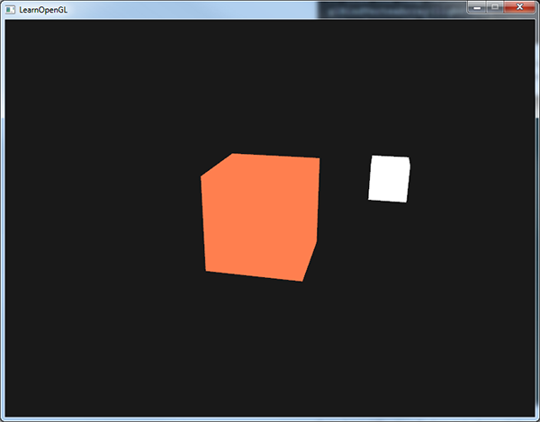

# 颜色

原文     | [Colors](http://learnopengl.com/#!Lighting/Colors)
      ---|---
作者     | JoeyDeVries
翻译     | [Geequlim](http://geequlim.com/)
校对     | [Geequlim](http://geequlim.com/)

在前面的教程中我们已经简要提到过该如何在OpenGL中使用颜色(Color)，但是我们至今所接触到的都是很浅层的知识。本节我们将会更广泛地讨论颜色，并且还会为接下来的光照(Lighting)教程创建一个场景。


现实世界中有无数种颜色，每一个物体都有它们自己的颜色。我们要做的工作是使用(有限的)数字来模拟真实世界中(无限)的颜色，因此并不是所有的现实世界中的颜色都可以用数字来表示。然而我们依然可以用数字来代表许多种颜色，并且你甚至可能根本感觉不到他们与真实颜色之间的差异。颜色可以数字化的由红色(Red)、绿色(Green)和蓝色(Blue)三个分量组成，它们通常被缩写为RGB。这三个不同的分量组合在一起几乎可以表示存在的任何一种颜色。例如,要获取一个**珊瑚红(Coral)**颜色我们可以这样定义一个颜色向量:

```c++
glm::vec3 coral(1.0f, 0.5f, 0.31f);
```

我们在现实生活中看到某一物体的颜色并不是这个物体的真实颜色，而是它所反射(Reflected)的颜色。换句话说，那些不能被物体吸收(Absorb)的颜色(被反射的颜色)就是我们能够感知到的物体的颜色。例如,太阳光被认为是由许多不同的颜色组合成的白色光(如下图所示)。如果我们将白光照在一个蓝色的玩具上，这个蓝色的玩具会吸收白光中除了蓝色以外的所有颜色，不被吸收的蓝色光被反射到我们的眼中，使我们看到了一个蓝色的玩具。下图显示的是一个珊瑚红的玩具，它以不同强度的方式反射了几种不同的颜色。


正如你所见，白色的阳光是一种所有可见颜色的集合，上面的物体吸收了其中的大部分颜色，它仅反射了那些代表这个物体颜色的部分，这些被反射颜色的组合就是我们感知到的颜色(此例中为珊瑚红)。

这些颜色反射的规律被直接地运用在图形领域。我们在OpenGL中创建一个光源时都会为它定义一个颜色。在前面的段落中所提到光源的颜色都是白色的，那我们就继续来创建一个白色的光源吧。当我们把光源的颜色与物体的颜色相乘，所得到的就是这个物体所反射该光源的颜色(也就是我们感知到的颜色)。让我们再次审视我们的玩具(这一次它还是珊瑚红)并看看如何计算出他的反射颜色。我们通过检索结果颜色的每一个分量来看一下光源色和物体颜色的反射运算：

```c++
glm::vec3 lightColor(1.0f, 1.0f, 1.0f);
glm::vec3 toyColor(1.0f, 0.5f, 0.31f);
glm::vec3 result = lightColor * toyColor; // = (1.0f, 0.5f, 0.31f);
```

我们可以看到玩具在进行反射时**吸收**了白色光源颜色中的大部分颜色，但它对红、绿、蓝三个分量都有一定的反射，反射量是由物体本身的颜色所决定的。这也代表着现实中的光线原理。由此，我们可以定义物体的颜色为**这个物体从一个光源反射各个颜色分量的多少**。现在，如果我们使用一束绿色的光又会发生什么呢？

```c++
glm::vec3 lightColor(0.0f, 1.0f, 0.0f);
glm::vec3 toyColor(1.0f, 0.5f, 0.31f);
glm::vec3 result = lightColor * toyColor; // = (0.0f, 0.5f, 0.0f);
```

可以看到，我们的玩具没有红色和蓝色的光让它来吸收或反射，这个玩具也吸收了光线中一半的绿色，当然它仍然反射了光的一半绿色。它现在看上去是深绿色(Dark-greenish)的。我们可以看到，如果我们用一束绿色的光线照来照射玩具，那么只有绿色能被反射和感知到，没有红色和蓝色能被反射和感知。这样做的结果是，一个珊瑚红的玩具突然变成了深绿色物体。现在我们来看另一个例子，使用深橄榄绿色(Dark olive-green)的光线：

```c++
glm::vec3 lightColor(0.33f, 0.42f, 0.18f);
glm::vec3 toyColor(1.0f, 0.5f, 0.31f);
glm::vec3 result = lightColor * toyColor; // = (0.33f, 0.21f, 0.06f);
```

如你所见，我们可以通过物体对不同颜色光的反射来的得到意想不到的不到的颜色，从此创作颜色已经变得非常简单。

目前有了这些颜色相关的理论已经足够了，接下来我们将创建一个场景用来做更多的实验。

# 创建一个光照场景

在接下来的教程中，我们将通过模拟真实世界中广泛存在的光照和颜色现象来创建有趣的视觉效果。现在我们将在场景中创建一个看得到的物体来代表光源，并且在场景中至少添加一个物体来模拟光照。

首先我们需要一个物体来投光(Cast the light)，我们将无耻地使用前面教程中的立方体箱子。我们还需要一个物体来代表光源，它代表光源在这个3D空间中的确切位置。简单起见，我们依然使用一个立方体来代表光源(我们已拥有立方体的[顶点数据](http://www.learnopengl.com/code_viewer.php?code=getting-started/cube_vertices)是吧？)。

当然，填一个顶点缓冲对象(VBO)，设定一下顶点属性指针和其他一些乱七八糟的东西现在对你来说应该很容易了，所以我们就不再赘述那些步骤了。如果你仍然觉得这很困难，我建议你复习[之前的教程](../01 Getting started/04 Hello Triangle.md)，并且在继续学习之前先把练习过一遍。

所以，我们首先需要一个顶点着色器来绘制箱子。与上一个教程的顶点着色器相比，容器的顶点位置保持不变(虽然这一次我们不需要纹理坐标)，因此顶点着色器中没有新的代码。我们将会使用上一篇教程顶点着色器的精简版：

```c++
#version 330 core
layout (location = 0) in vec3 position;

uniform mat4 model;
uniform mat4 view;
uniform mat4 projection;

void main()
{
    gl_Position = projection * view * model * vec4(position, 1.0f);
}
```

请确认更新你的顶点数据和属性对应的指针与新的顶点着色器一致(当然你可以继续保留纹理数据并保持属性对应的指针有效。在这一节中我们不使用纹理，但如果你想要一个全新的开始那也不是什么坏主意)。

因为我们还要创建一个表示灯(光源)的立方体，所以我们还要为这个灯创建一个特殊的VAO。当然我们也可以让这个灯和其他物体使用同一个VAO然后对他的`model`(模型)矩阵做一些变换，然而接下来的教程中我们会频繁地对顶点数据做一些改变并且需要改变属性对应指针设置，我们并不想因此影响到灯(我们只在乎灯的位置)，因此我们有必要为灯创建一个新的VAO。

```c++
GLuint lightVAO;
glGenVertexArrays(1, &lightVAO);
glBindVertexArray(lightVAO);
// 只需要绑定VBO不用再次设置VBO的数据，因为容器(物体)的VBO数据中已经包含了正确的立方体顶点数据
glBindBuffer(GL_ARRAY_BUFFER, VBO);
// 设置灯立方体的顶点属性指针(仅设置灯的顶点数据)
glVertexAttribPointer(0, 3, GL_FLOAT, GL_FALSE, 3 * sizeof(GLfloat), (GLvoid*)0);
glEnableVertexAttribArray(0);
glBindVertexArray(0);
```

这段代码对你来说应该非常直观。既然我们已经创建了表示灯和被照物体的立方体，我们只需要再定义一个东西就行了了，那就是片段着色器

```c++
#version 330 core
out vec4 color;

uniform vec3 objectColor;
uniform vec3 lightColor;

void main()
{
    color = vec4(lightColor * objectColor, 1.0f);
}
```

这个片段着色器接受两个分别表示物体颜色和光源颜色的uniform变量。正如本篇教程一开始所讨论的一样，我们将光源的颜色与物体(能反射)的颜色相乘。这个着色器应该很容易理解。接下来让我们把物体的颜色设置为上一节中所提到的珊瑚红并把光源设置为白色：

```c++
// 在此之前不要忘记首先'使用'对应的着色器程序(来设定uniform)
GLint objectColorLoc = glGetUniformLocation(lightingShader.Program, "objectColor");
GLint lightColorLoc  = glGetUniformLocation(lightingShader.Program, "lightColor");
glUniform3f(objectColorLoc, 1.0f, 0.5f, 0.31f);// 我们所熟悉的珊瑚红
glUniform3f(lightColorLoc,  1.0f, 1.0f, 1.0f); // 依旧把光源设置为白色
```

要注意的是，当我们修改顶点或者片段着色器后，灯的位置或颜色也会随之改变，这并不是我们想要的效果。我们不希望灯对象的颜色在接下来的教程中因光照计算的结果而受到影响，而希望它能够独立。希望表示灯不受其他光照的影响而一直保持明亮(这样它才更像是一个真实的光源)。

为了实现这个目的，我们需要为灯创建另外的一套着色器程序，从而能保证它能够在其他光照着色器变化的时候保持不变。顶点着色器和我们当前的顶点着色器是一样的，所以你可以直接把灯的顶点着色器复制过来。片段着色器保证了灯的颜色一直是亮的，我们通过给灯定义一个常量的白色来实现：

```c++
#version 330 core
out vec4 color;

void main()
{
    color = vec4(1.0f); //设置四维向量的所有元素为 1.0f
}
```

当我们想要绘制我们的物体的时候，我们需要使用刚刚定义的光照着色器绘制箱子(或者可能是其它的一些物体)，让我们想要绘制灯的时候，我们会使用灯的着色器。在之后的教程里我们会逐步升级这个光照着色器从而能够缓慢的实现更真实的效果。

使用这个灯立方体的主要目的是为了让我们知道光源在场景中的具体位置。我们通常在场景中定义一个光源的位置，但这只是一个位置，它并没有视觉意义。为了显示真正的灯，我们将表示光源的灯立方体绘制在与光源同样的位置。我们将使用我们为它新建的片段着色器让它保持它一直处于白色状态，不受场景中的光照影响。

我们声明一个全局`vec3`变量来表示光源在场景的世界空间坐标中的位置：

```c++
glm::vec3 lightPos(1.2f, 1.0f, 2.0f);
```

然后我们把灯平移到这儿，当然我们需要对它进行缩放，让它不那么明显：

```c++
model = glm::mat4();
model = glm::translate(model, lightPos);
model = glm::scale(model, glm::vec3(0.2f));
```

绘制灯立方体的代码应该与下面的类似：

```c++
lampShader.Use();
// 设置模型、视图和投影矩阵uniform
...
// 绘制灯立方体对象
glBindVertexArray(lightVAO);
glDrawArrays(GL_TRIANGLES, 0, 36);
glBindVertexArray(0);
```

请把上述的所有代码片段放在你程序中合适的位置，这样我们就能有一个干净的光照实验场地了。如果一切顺利，运行效果将会如下图所示：



没什么好看的是吗？但我保证在接下来的教程中它会给你有趣的视觉效果。

如果你在把上述代码片段放到一起编译遇到困难，可以去认真地看看我的[源代码](http://learnopengl.com/code_viewer.php?code=lighting/colors_scene)。你好最自己实现一遍这些操作。

现在我们有了一些关于颜色的知识，并且创建了一个基本的场景能够绘制一些漂亮的光线。你现在可以阅读[下一节](02 Basic Lighting.md)，真正的魔法即将开始！
