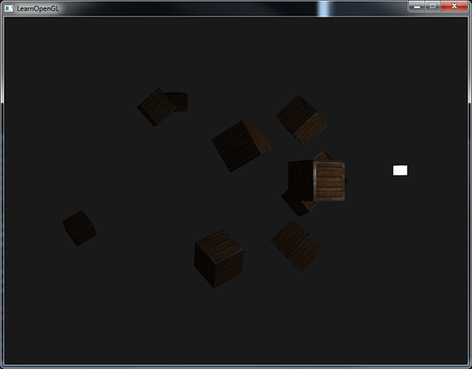
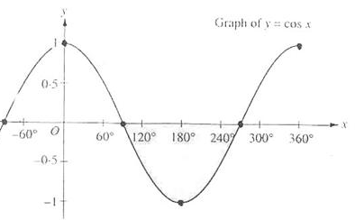
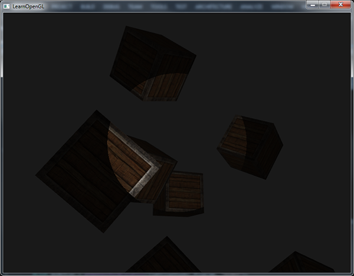
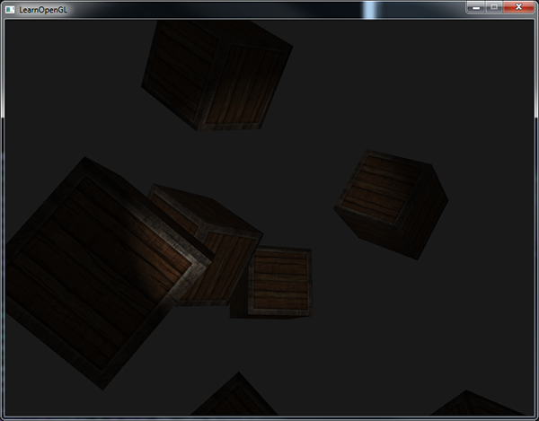

# 投光物

原文     | [Light casters](http://www.learnopengl.com/#!Lighting/Light-casters)
      ---|---
作者     | JoeyDeVries
翻译     | Krasjet
校对     | 暂未校对

我们目前使用的光照都来自于空间中的一个点。它能给我们不错的效果，但现实世界中，我们有很多种类的光照，每种的表现都不同。将光**投射**(Cast)到物体的光源叫做<def>投光物</def>(Light Caster)。在这一节中，我们将会讨论几种不同类型的投光物。学会模拟不同种类的光源是又一个能够进一步丰富场景的工具。

我们首先将会讨论定向光(Directional Light)，接下来是点光源(Point Light)，它是我们之前学习的光源的拓展，最后我们将会讨论聚光(Spotlight)。在[下一节](06 Multiple lights.md)中我们将讨论如何将这些不同种类的光照类型整合到一个场景之中。

# 平行光

当一个光源处于很远的地方时，来自光源的每条光线就会近似于互相平行。不论物体和/或者观察者的位置，看起来好像所有的光都来自于同一个方向。当我们使用一个假设光源处于**无限**远处的模型时，它就被称为<def>定向光</def>，因为它的所有光线都有着相同的方向，它与光源的位置是没有关系的。

定向光非常好的一个例子就是太阳。太阳距离我们并不是无限远，但它已经远到在光照计算中可以把它视为无限远了。所以来自太阳的所有光线将被模拟为平行光线，我们可以在下图看到：


因为所有的光线都是平行的，所以物体与光源的相对位置是不重要的，因为对场景中每一个物体光的方向都是一致的。由于光的位置向量保持一致，场景中每个物体的光照计算将会是类似的。

我们可以定义一个光线方向向量而不是位置向量来模拟一个定向光。着色器的计算基本保持不变，但这次我们将直接使用光的<var>direction</var>向量而不是通过<var>direction</var>来计算<var>lightDir</var>向量。

```c++
struct Light {
    // vec3 position; // 使用定向光就不再需要了
    vec3 direction;
  
    vec3 ambient;
    vec3 diffuse;
    vec3 specular;
};
...
void main()
{
  vec3 lightDir = normalize(-light.direction);
  ...
}
```

注意我们首先对<var>light.direction</var>向量取反。我们目前使用的光照计算需求一个从片段**至**光源的光线方向，但人们更习惯定义定向光为一个**从**光源出发的全局方向。所以我们需要对全局光照方向向量取反来改变它的方向，它现在是一个指向光源的方向向量了。而且，记得对向量进行标准化，假设输入向量为一个单位向量是很不明智的。

最终的<var>lightDir</var>向量将和以前一样用在漫反射和镜面光计算中。

为了清楚地展示定向光对多个物体具有相同的影响，我们将会再次使用[坐标系统](../01 Getting started/08 Coordinate Systems.md)章节最后的那个箱子派对的场景。如果你错过了派对，我们先定义了十个不同的[箱子位置](https://learnopengl.com/code_viewer.php?code=lighting/light_casters_container_positions)，并对每个箱子都生成了一个不同的模型矩阵，每个模型矩阵都包含了对应的局部-世界坐标变换：

```c++
for(unsigned int i = 0; i < 10; i++)
{
    glm::mat4 model;
    model = glm::translate(model, cubePositions[i]);
    float angle = 20.0f * i;
    model = glm::rotate(model, glm::radians(angle), glm::vec3(1.0f, 0.3f, 0.5f));
    lightingShader.setMat4("model", model);

    glDrawArrays(GL_TRIANGLES, 0, 36);
}
```

同时，不要忘记定义光源的方向（注意我们将方向定义为**从**光源出发的方向，你可以很容易看到光的方向朝下）。

```c++
lightingShader.setVec3("light.direction", -0.2f, -1.0f, -0.3f);
```

!!! Important

	我们一直将光的位置和位置向量定义为`vec3`，但一些人会喜欢将所有的向量都定义为`vec4`。当我们将位置向量定义为一个`vec4`时，很重要的一点是要将w分量设置为1.0，这样变换和投影才能正确应用。然而，当我们定义一个方向向量为`vec4`的时候，我们不想让位移有任何的效果（因为它仅仅代表的是方向），所以我们将w分量设置为0.0。

	方向向量就会像这样来表示：`vec4(0.2f, 1.0f, 0.3f, 0.0f)`。这也可以作为一个快速检测光照类型的工具：你可以检测w分量是否等于1.0，来检测它是否是光的位置向量；w分量等于0.0，则它是光的方向向量，这样就能根据这个来调整光照计算了：

		if(lightVector.w == 0.0) // 注意浮点数据类型的误差
		  // 执行定向光照计算
		else if(lightVector.w == 1.0)
		  // 根据光源的位置做光照计算（与上一节一样）

	你知道吗：这正是旧OpenGL（固定函数式）决定光源是定向光还是位置光源(Positional Light Source)的方法，并根据它来调整光照。

如果你现在编译程序，在场景中自由移动，你就可以看到好像有一个太阳一样的光源对所有的物体投光。你能注意到漫反射和镜面光分量的反应都好像在天空中有一个光源的感觉吗？它会看起来像这样：


你可以在[这里](https://learnopengl.com/code_viewer_gh.php?code=src/2.lighting/5.1.light_casters_directional/light_casters_directional.cpp)找到程序的所有代码。

# 点光源

定向光对于照亮整个场景的全局光源是非常棒的，但除了定向光之外我们也需要一些分散在场景中的<def>点光源</def>(Point Light)。点光源是处于世界中某一个位置的光源，它会朝着所有方向发光，但光线会随着距离逐渐衰减。想象作为投光物的灯泡和火把，它们都是点光源。


在之前的教程中，我们一直都在使用一个（简化的）点光源。我们在给定位置有一个光源，它会从它的光源位置开始朝着所有方向散射光线。然而，我们定义的光源模拟的是永远不会衰减的光线，这看起来像是光源亮度非常的强。在大部分的3D模拟中，我们都希望模拟的光源仅照亮光源附近的区域而不是整个场景。

如果你将10个箱子加入到上一节光照场景中，你会注意到在最后面的箱子和在灯面前的箱子都以相同的强度被照亮，并没有定义一个公式来将光随距离衰减。我们希望在后排的箱子与前排的箱子相比仅仅是被轻微地照亮。

## 衰减

随着光线传播距离的增长逐渐削减光的强度通常叫做<def>衰减</def>(Attenuation)。随距离减少光强度的一种方式是使用一个线性方程。这样的方程能够随着距离的增长线性地减少光的强度，从而让远处的物体更暗。然而，这样的线性方程通常会看起来比较假。在现实世界中，灯在近处通常会非常亮，但随着距离的增加光源的亮度一开始会下降非常快，但在远处时剩余的光强度就会下降的非常缓慢了。所以，我们需要一个不同的公式来减少光的强度。

幸运的是一些聪明的人已经帮我们解决了这个问题。下面这个公式根据片段距光源的距离计算了衰减值，之后我们会将它乘以光的强度向量：

$$
\begin{equation} F_{att} = \frac{1.0}{K_c + K_l * d + K_q * d^2} \end{equation}
$$

在这里\(d\)代表了片段距光源的距离。接下来为了计算衰减值，我们定义3个（可配置的）项：<def>常数</def>项\(K_c\)、<def>一次</def>项\(K_l\)和<def>二次</def>项\(K_q\)。

- 常数项通常保持为1.0，它的主要作用是保证分母永远不会比1小，否则的话在某些距离上它反而会增加强度，这肯定不是我们想要的效果。
- 一次项会与距离值相乘，以线性的方式减少强度。
- 二次项会与距离的平方相乘，让光源以二次递减的方式减少强度。二次项在距离比较小的时候影响会比一次项小很多，但当距离值比较大的时候它就会比一次项更大了。

由于二次项的存在，光线会在大部分时候以线性的方式衰退，直到距离变得足够大，让二次项超过一次项，光的强度会以更快的速度下降。这样的结果就是，光在近距离时亮度很高，但随着距离变远亮度迅速降低，最后会以更慢的速度减少亮度。下面这张图显示了在100的距离内衰减的效果：


你可以看到光在近距离的时候有着最高的强度，但随着距离增长，它的强度明显减弱，并缓慢地在距离大约100的时候强度接近0。这正是我们想要的。

### 选择正确的值

但是，该对这三个项设置什么值呢？正确地设定它们的值取决于很多因素：环境、希望光覆盖的距离、光的类型等。在大多数情况下，这都是经验的问题，以及适量的调整。下面这个表格显示了模拟一个（大概）真实的，覆盖特定半径（距离）的光源时，这些项可能取的一些值。第一列指定的是在给定的三项时光所能覆盖的距离。这些值是大多数光源很好的起始点，它们由[Ogre3D的Wiki](http://www.ogre3d.org/tikiwiki/tiki-index.php?page=-Point+Light+Attenuation)所提供：

距离|常数项|一次项|二次项
-------|------|-----|------
7|1.0|0.7|1.8
13|1.0|0.35|0.44
20|1.0|0.22|0.20
32|1.0|0.14|0.07
50|1.0|0.09|0.032
65|1.0|0.07|0.017
100|1.0|0.045|0.0075
160|1.0|0.027|0.0028
200|1.0|0.022|0.0019
325|1.0|0.014|0.0007
600|1.0|0.007|0.0002
3250|1.0|0.0014|0.000007

你可以看到，常数项\(K_c\)在所有的情况下都是1.0。一次项\(K_l\)为了覆盖更远的距离通常都很小，二次项\(K_q\)甚至更小。尝试对这些值进行实验，看看它们在你的实现中有什么效果。在我们的环境中，32到100的距离对大多数的光源都足够了。

### 实现衰减

为了实现衰减，在片段着色器中我们还需要三个额外的值：也就是公式中的常数项、一次项和二次项。它们最好储存在之前定义的<fun>Light</fun>结构体中。注意我们使用上一节中计算<var>lightDir</var>的方法，而不是上面**定向光**部分的。

```c++
struct Light {
    vec3 position;  
  
    vec3 ambient;
    vec3 diffuse;
    vec3 specular;
	
    float constant;
    float linear;
    float quadratic;
};
```

然后我们将在OpenGL中设置这些项：我们希望光源能够覆盖50的距离，所以我们会使用表格中对应的常数项、一次项和二次项：

```c++
lightingShader.setFloat("light.constant",  1.0f);
lightingShader.setFloat("light.linear",    0.09f);
lightingShader.setFloat("light.quadratic", 0.032f);
```

在片段着色器中实现衰减还是比较直接的：我们根据公式计算衰减值，之后再分别乘以环境光、漫反射和镜面光分量。

我们仍需要公式中距光源的距离，还记得我们是怎么计算一个向量的长度的吗？我们可以通过获取片段和光源之间的向量差，并获取结果向量的长度作为距离项。我们可以使用GLSL内建的<fun>length</fun>函数来完成这一点：

```c++
float distance    = length(light.position - FragPos);
float attenuation = 1.0 / (light.constant + light.linear * distance + 
    		    light.quadratic * (distance * distance));
```

接下来，我们将包含这个衰减值到光照计算中，将它分别乘以环境光、漫反射和镜面光颜色。

!!! Important

	我们可以将环境光分量保持不变，让环境光照不会随着距离减少，但是如果我们使用多于一个的光源，所有的环境光分量将会开始叠加，所以在这种情况下我们也希望衰减环境光照。简单实验一下，看看什么才能在你的环境中效果最好。

```c++
ambient  *= attenuation; 
diffuse  *= attenuation;
specular *= attenuation;
```

如果你运行程序的话，你会获得这样的结果：



你可以看到，只有前排的箱子被照亮的，距离最近的箱子是最亮的。后排的箱子一点都没有照亮，因为它们离光源实在是太远了。你可以在[这里](https://learnopengl.com/code_viewer_gh.php?code=src/2.lighting/5.2.light_casters_point/light_casters_point.cpp)找到程序的代码。

点光源就是一个能够配置位置和衰减的光源。它是我们光照工具箱中的又一个光照类型。

# 聚光

我们要讨论的最后一种类型的光是<def>聚光</def>(Spotlight)。聚光是位于环境中某个位置的光源，它只朝一个特定方向而不是所有方向照射光线。这样的结果就是只有在聚光方向的特定半径内的物体才会被照亮，其它的物体都会保持黑暗。聚光很好的例子就是路灯或手电筒。

OpenGL中聚光是用一个世界空间位置、一个方向和一个<def>切光</def>角(Cutoff Angle)来表示的，切光角指定了聚光的半径（译注：是圆锥的半径不是距光源距离那个半径）。对于每个片段，我们会计算片段是否位于聚光的切光方向之间（也就是在锥形内），如果是的话，我们就会相应地照亮片段。下面这张图会让你明白聚光是如何工作的：


- `LightDir`：从片段指向光源的向量。
- `SpotDir`：聚光所指向的方向。
- `Phi`\(\phi\)：指定了聚光半径的切光角。落在这个角度之外的物体都不会被这个聚光所照亮。
- `Theta`\(\theta\)：<var>LightDir</var>向量和<var>SpotDir</var>向量之间的夹角。在聚光内部的话\(\theta\)值应该比\(\phi\)值小。

所以我们要做的就是计算<var>LightDir</var>向量和<var>SpotDir</var>向量之间的点积（还记得它会返回两个单位向量夹角的余弦值吗？），并将它与切光角\(\phi\)值对比。你现在应该了解聚光究竟是什么了，下面我们将以手电筒的形式创建一个聚光。

## 手电筒

手电筒(Flashlight)是一个位于观察者位置的聚光，通常它都会瞄准玩家视角的正前方。基本上说，手电筒就是普通的聚光，但它的位置和方向会随着玩家的位置和朝向不断更新。

所以，在片段着色器中我们需要的值有聚光的位置向量（来计算光的方向向量）、聚光的方向向量和一个切光角。我们可以将它们储存在<fun>Light</fun>结构体中：

```c++
struct Light {
    vec3  position;
    vec3  direction;
    float cutOff;
    ...
};
```

接下来我们将合适的值传到着色器中：

```c++
lightingShader.setVec3("light.position",  camera.Position);
lightingShader.setVec3("light.direction", camera.Front);
lightingShader.setFloat("light.cutOff",   glm::cos(glm::radians(12.5f)));
```

你可以看到，我们并没有给切光角设置一个角度值，反而是用角度值计算了一个余弦值，将余弦结果传递到片段着色器中。这样做的原因是在片段着色器中，我们会计算`LightDir`和`SpotDir`向量的点积，这个点积返回的将是一个余弦值而不是角度值，所以我们不能直接使用角度值和余弦值进行比较。为了获取角度值我们需要计算点积结果的反余弦，这是一个开销很大的计算。所以为了节约一点性能开销，我们将会计算切光角对应的余弦值，并将它的结果传入片段着色器中。由于这两个角度现在都由余弦角来表示了，我们可以直接对它们进行比较而不用进行任何开销高昂的计算。

接下来就是计算\(\theta\)值，并将它和切光角\(\phi\)对比，来决定是否在聚光的内部：

```c++
float theta = dot(lightDir, normalize(-light.direction));
    
if(theta > light.cutOff) 
{       
  // 执行光照计算
}
else  // 否则，使用环境光，让场景在聚光之外时不至于完全黑暗
  color = vec4(light.ambient * vec3(texture(material.diffuse, TexCoords)), 1.0);
```

我们首先计算了<var>lightDir</var>和取反的<var>direction</var>向量（取反的是因为我们想让向量指向光源而不是从光源出发）之间的点积。记住要对所有的相关向量标准化。

!!! Important

	你可能奇怪为什么在if条件中使用的是 > 符号而不是 < 符号。<var>theta</var>不应该比光的切光角更小才是在聚光内部吗？这并没有错，但不要忘记角度值现在都由余弦值来表示的。一个0度的角度表示的是1.0的余弦值，而一个90度的角度表示的是0.0的余弦值，你可以在下图中看到：

    

	你现在可以看到，余弦值越接近1.0，它的角度就越小。这也就解释了为什么<var>theta</var>要比切光值更大了。切光值目前设置为12.5的余弦，约等于0.9978，所以在0.9979到1.0内的<var>theta</var>值才能保证片段在聚光内，从而被照亮。

运行程序，你将会看到一个聚光，它仅会照亮聚光圆锥内的片段。看起来像是这样的：



你可以在[这里](https://learnopengl.com/code_viewer_gh.php?code=src/2.lighting/5.3.light_casters_spot/light_casters_spot.cpp)获得全部源码。

但这仍看起来有些假，主要是因为聚光有一圈硬边。当一个片段遇到聚光圆锥的边缘时，它会完全变暗，没有一点平滑的过渡。一个真实的聚光将会在边缘处逐渐减少亮度。

## 平滑/软化边缘

为了创建一种看起来边缘平滑的聚光，我们需要模拟聚光有一个<def>内</def>圆锥(Inner Cone)和一个<def>外</def>圆锥(Outer Cone)。我们可以将内圆锥设置为上一部分中的那个圆锥，但我们也需要一个外圆锥，来让光从内圆锥逐渐减暗，直到外圆锥的边界。

为了创建一个外圆锥，我们只需要再定义一个余弦值来代表聚光方向向量和外圆锥向量（等于它的半径）的夹角。然后，如果一个片段处于内外圆锥之间，将会给它计算出一个0.0到1.0之间的强度值。如果片段在内圆锥之内，它的强度就是1.0，如果在外圆锥之外强度值就是0.0。

我们可以用下面这个公式来计算这个值：

$$
\begin{equation} I = \frac{\theta - \gamma}{\epsilon} \end{equation}
$$

这里\(\epsilon\)(Epsilon)是内（\(\phi\)）和外圆锥（\(\gamma\)）之间的余弦值差（\(\epsilon =  \phi - \gamma\)）。最终的\(I\)值就是在当前片段聚光的强度。

很难去表现这个公式是怎么工作的，所以我们用一些实例值来看看：

\(\theta\)|\(\theta\)（角度）|\(\phi\)（内光切）|\(\phi\)（角度）|\(\gamma\)（外光切）|\(\gamma\)（角度）|\(\epsilon\)|\(I\)
--|---|---|---|---|---|---|---
0.87|30|0.91|25|0.82|35|0.91 - 0.82 = 0.09|0.87 - 0.82 / 0.09 = 0.56
0.9|26|0.91|25|0.82|35|0.91 - 0.82 = 0.09|0.9 - 0.82 / 0.09 = 0.89
0.97|14|0.91|25|0.82|35|0.91 - 0.82 = 0.09|0.97 - 0.82 / 0.09 = 1.67
0.83|34|0.91|25|0.82|35|0.91 - 0.82 = 0.09|0.83 - 0.82 / 0.09 = 0.11
0.64|50|0.91|25|0.82|35|0.91 - 0.82 = 0.09|0.64 - 0.82 / 0.09 = -2.0
0.966|15|0.9978|12.5|0.953|17.5|0.9978 - 0.953 = 0.0448|0.966 - 0.953 / 0.0448 = 0.29

你可以看到，我们基本是在内外余弦值之间根据\(\theta\)插值。如果你仍不明白发生了什么，不必担心，只需要记住这个公式就好了，在你更聪明的时候再回来看看。

我们现在有了一个在聚光外是负的，在内圆锥内大于1.0的，在边缘处于两者之间的强度值了。如果我们正确地约束(Clamp)这个值，在片段着色器中就不再需要`if-else`了，我们能够使用计算出来的强度值直接乘以光照分量：

```c++
float theta     = dot(lightDir, normalize(-light.direction));
float epsilon   = light.cutOff - light.outerCutOff;
float intensity = clamp((theta - light.outerCutOff) / epsilon, 0.0, 1.0);    
...
// 将不对环境光做出影响，让它总是能有一点光
diffuse  *= intensity;
specular *= intensity;
...
```

注意我们使用了<fun>clamp</fun>函数，它把第一个参数约束(Clamp)在了0.0到1.0之间。这保证强度值不会在[0, 1]区间之外。

确定你将<var>outerCutOff</var>值添加到了<fun>Light</fun>结构体之中，并在程序中设置它的uniform值。下面的图片中，我们使用的内切光角是12.5，外切光角是17.5：



啊，这样看起来就好多了。稍微对内外切光角实验一下，尝试创建一个更能符合你需求的聚光。你可以在[这里](https://learnopengl.com/code_viewer_gh.php?code=src/2.lighting/5.4.light_casters_spot_soft/light_casters_spot_soft.cpp)找到程序的源码。

这样的手电筒/聚光类型的灯光非常适合恐怖游戏，结合定向光和点光源，环境就会开始被照亮了。在[下一节](06 Multiple lights.md)的教程中，我们将会结合我们至今讨论的所有光照和技巧。

## 练习

- 尝试实验一下上面的所有光照类型和它们的片段着色器。试着对一些向量进行取反，并使用 < 来代替 >。试着解释不同视觉效果产生的原因。
