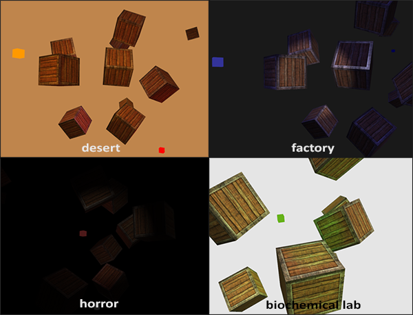

# 多光源

原文     | [Multiple lights](http://learnopengl.com/#!Lighting/Multiple-lights)
      ---|---
作者     | JoeyDeVries
翻译     | [Geequlim](http://geequlim.com), Meow J
校对     | 暂未校对

我们在前面的教程中已经学习了许多关于OpenGL中光照的知识，其中包括冯氏着色(Phong Shading)、材质(Material)、光照贴图(Lighting Map)以及不同种类的投光物(Light Caster)。在这一节中，我们将结合之前学过的所有知识，创建一个包含六个光源的场景。我们将模拟一个类似太阳的定向光(Directional Light)光源，四个分散在场景中的点光源(Point Light)，以及一个手电筒(Flashlight)。

为了在场景中使用多个光源，我们希望将光照计算封装到GLSL<def>函数</def>中。这样做的原因是，每一种光源都需要一种不同的计算方法，而一旦我们想对多个光源进行光照计算时，代码很快就会变得非常复杂。如果我们只在<fun>main</fun>函数中进行所有的这些计算，代码很快就会变得难以理解。

GLSL中的函数和C函数很相似，它有一个函数名、一个返回值类型，如果函数不是在main函数之前声明的，我们还必须在代码文件顶部声明一个原型。我们对每个光照类型都创建一个不同的函数：定向光、点光源和聚光。

当我们在场景中使用多个光源时，通常使用以下方法：我们需要有一个单独的颜色向量代表片段的输出颜色。对于每一个光源，它对片段的贡献颜色将会加到片段的输出颜色向量上。所以场景中的每个光源都会计算它们各自对片段的影响，并结合为一个最终的输出颜色。大体的结构会像是这样：

```c++
out vec4 FragColor;
  
void main()
{
  // 定义一个输出颜色值
  vec3 output;
  // 将定向光的贡献加到输出中
  output += someFunctionToCalculateDirectionalLight();
  // 对所有的点光源也做相同的事情
  for(int i = 0; i < nr_of_point_lights; i++)
  	output += someFunctionToCalculatePointLight();
  // 也加上其它的光源（比如聚光）
  output += someFunctionToCalculateSpotLight();
  
  FragColor = vec4(output, 1.0);
}
```

实际的代码对每一种实现都可能不同，但大体的结构都是差不多的。我们定义了几个函数，用来计算每个光源的影响，并将最终的结果颜色加到输出颜色向量上。例如，如果两个光源都很靠近一个片段，那么它们所结合的贡献将会形成一个比单个光源照亮时更加明亮的片段。

## 定向光

我么需要在片段着色器中定义一个函数来计算定向光对相应片段的贡献：它接受一些参数并计算一个定向光照颜色。

首先，我们需要定义一个定向光源最少所需要的变量。我们可以将这些变量储存在一个叫做<fun>DirLight</fun>的结构体中，并将它定义为一个uniform。需要的变量在[上一节](05 Light casters.md)中都介绍过：

```c++
struct DirLight {
    vec3 direction;
  
    vec3 ambient;
    vec3 diffuse;
    vec3 specular;
};  
uniform DirLight dirLight;
```

接下来我们可以将<var>dirLight</var>传入一个有着一下原型的函数。

```c++
vec3 CalcDirLight(DirLight light, vec3 normal, vec3 viewDir);
```

!!! Important

	和C/C++一样，如果我们想调用一个函数（这里是在<fun>main</fun>函数中调用），这个函数需要在调用者的行数之前被定义过。在这个例子中我们更喜欢在<fun>main</fun>函数以下定义函数，所以上面要求就不满足了。所以，我们需要在<fun>main</fun>函数之上定义函数的原型，这和C语言中是一样的。

你可以看到，这个函数需要一个<fun>DirLight</fun>结构体和其它两个向量来进行计算。如果你认真完成了上一节的话，这个函数的内容应该理解起来很容易：

```c++
vec3 CalcDirLight(DirLight light, vec3 normal, vec3 viewDir)
{
    vec3 lightDir = normalize(-light.direction);
    // 漫反射着色
    float diff = max(dot(normal, lightDir), 0.0);
    // 镜面光着色
    vec3 reflectDir = reflect(-lightDir, normal);
    float spec = pow(max(dot(viewDir, reflectDir), 0.0), material.shininess);
    // 合并结果
    vec3 ambient  = light.ambient  * vec3(texture(material.diffuse, TexCoords));
    vec3 diffuse  = light.diffuse  * diff * vec3(texture(material.diffuse, TexCoords));
    vec3 specular = light.specular * spec * vec3(texture(material.specular, TexCoords));
    return (ambient + diffuse + specular);
}
```

我们基本上只是从上一节中复制了代码，并使用函数参数的两个向量来计算定向光的贡献向量。最终环境光、漫反射和镜面光的贡献将会合并为单个颜色向量返回。

## 点光源

和定向光一样，我们也希望定义一个用于计算点光源对相应片段贡献，以及衰减，的函数。同样，我们定义一个包含了点光源所需所有变量的结构体：

```c++
struct PointLight {
    vec3 position;
    
    float constant;
    float linear;
    float quadratic;

    vec3 ambient;
    vec3 diffuse;
    vec3 specular;
};  
#define NR_POINT_LIGHTS 4
uniform PointLight pointLights[NR_POINT_LIGHTS];
```

你可以看到，我们在GLSL中使用了预处理指令来定义了我们场景中点光源的数量。接着我们使用了这个<var>NR_POINT_LIGHTS</var>常量来创建了一个<fun>PointLight</fun>结构体的数组。GLSL中的数组和C数组一样，可以使用一对方括号来创建。现在我们有四个待填充数据的<fun>PointLight</fun>结构体。

!!! Important

	我们也可以定义**一个**大的结构体（而不是为每种类型的光源定义不同的结构体），包含**所有**不同种光照类型所需的变量，并将这个结构体用到所有的函数中，只需要忽略用不到的变量就行了。然而，我个人觉得当前的方法会更直观一点，不仅能够节省一些代码，而且由于不是所有光照类型都需要所有的变量，这样也能节省一些内存。

点光源函数的原型如下：

```c++
vec3 CalcPointLight(PointLight light, vec3 normal, vec3 fragPos, vec3 viewDir);
```

这个函数从参数中获取所需的所有数据，并返回一个代表该点光源对片段的颜色贡献的`vec3`。我们再一次聪明地从之前的教程中复制粘贴代码，完成了下面这样的函数：

```c++
vec3 CalcPointLight(PointLight light, vec3 normal, vec3 fragPos, vec3 viewDir)
{
    vec3 lightDir = normalize(light.position - fragPos);
    // 漫反射着色
    float diff = max(dot(normal, lightDir), 0.0);
    // 镜面光着色
    vec3 reflectDir = reflect(-lightDir, normal);
    float spec = pow(max(dot(viewDir, reflectDir), 0.0), material.shininess);
    // 衰减
    float distance    = length(light.position - fragPos);
    float attenuation = 1.0 / (light.constant + light.linear * distance + 
  			     light.quadratic * (distance * distance));    
    // 合并结果
    vec3 ambient  = light.ambient  * vec3(texture(material.diffuse, TexCoords));
    vec3 diffuse  = light.diffuse  * diff * vec3(texture(material.diffuse, TexCoords));
    vec3 specular = light.specular * spec * vec3(texture(material.specular, TexCoords));
    ambient  *= attenuation;
    diffuse  *= attenuation;
    specular *= attenuation;
    return (ambient + diffuse + specular);
}
```

将这些功能抽象到这样一个函数中的优点是，我们能够不用重复的代码而很容易地计算多个点光源的光照了。在<fun>main</fun>函数中，我们只需要创建一个循环，遍历整个点光源数组，对每个点光源调用<fun>CalcPointLight</fun>就可以了。

## 合并结果

现在我们已经定义了一个计算定向光的函数和一个计算点光源的函数了，我们可以将它们合并放到<fun>main</fun>函数中。

我们现在定义了用于计算平行光和点光源的函数，现在我们把这些代码放到一起，写入文开始的一般结构中：

```c++
void main()
{
    // 属性
    vec3 norm = normalize(Normal);
    vec3 viewDir = normalize(viewPos - FragPos);

    // 第一阶段：定向光照
    vec3 result = CalcDirLight(dirLight, norm, viewDir);
    // 第二阶段：点光源
    for(int i = 0; i < NR_POINT_LIGHTS; i++)
        result += CalcPointLight(pointLights[i], norm, FragPos, viewDir);    
    // 第三阶段：聚光
    //result += CalcSpotLight(spotLight, norm, FragPos, viewDir);    
    
    FragColor = vec4(result, 1.0);
}
```

每个光源类型都将它们的贡献加到了最终的输出颜色上，直到所有的光源都处理完了。最终的颜色包含了场景中所有光源的颜色影响所合并的结果。如果你想的话，你也可以实现一个聚光，并将它的效果加到输出颜色中。我们会将<fun>CalcSpotLight</fun>函数留给读者作为练习。

设置定向光结构体的uniform应该非常熟悉了，但是你可能会在想我们该如何设置点光源的uniform值，因为点光源的uniform现在是一个<fun>PointLight</fun>的数组了。这并不是我们以前讨论过的话题。

很幸运的是，这并不是很复杂，设置一个结构体数组的uniform和设置一个结构体的uniform是很相似的，但是这一次在访问uniform位置的时候，我们需要定义对应的数组下标值：

```c++
lightingShader.setFloat("pointLights[0].constant", 1.0f);
```

在这里我们索引了<var>pointLights</var>数组中的第一个<fun>PointLight</fun>，并获取了<var>constant</var>变量的位置。但这也意味着不幸的是我们必须对这四个点光源手动设置uniform值，这让点光源本身就产生了28个uniform调用，非常冗长。你也可以尝试将这些抽象出去一点，定义一个点光源类，让它来为你设置uniform值，但最后你仍然要用这种方式设置所有光源的uniform值。

别忘了，我们还需要为每个点光源定义一个位置向量，所以我们让它们在场景中分散一点。我们会定义另一个`glm::vec3`数组来包含点光源的位置：

```c++
glm::vec3 pointLightPositions[] = {
	glm::vec3( 0.7f,  0.2f,  2.0f),
	glm::vec3( 2.3f, -3.3f, -4.0f),
	glm::vec3(-4.0f,  2.0f, -12.0f),
	glm::vec3( 0.0f,  0.0f, -3.0f)
};
```

接下来我们从<var>pointLights</var>数组中索引对应的<fun>PointLight</fun>，将它的<var>position</var>值设置为刚刚定义的位置值数组中的其中一个。同时我们还要保证现在绘制的是四个灯立方体而不是仅仅一个。只要对每个灯物体创建一个不同的模型矩阵就可以了，和我们之前对箱子的处理类似。

如果你还使用了手电筒的话，所有光源组合的效果将看起来和下图差不多：


你可以看到，很显然天空中有一个全局照明（像一个太阳），我们有四个光源分散在场景中，以及玩家视角的手电筒。看起来是不是非常不错？

你可以在[这里](https://learnopengl.com/code_viewer_gh.php?code=src/2.lighting/6.multiple_lights/multiple_lights.cpp)找到最终程序的源代码。

上面图片中的所有光源都是使用上一节中所使用的默认属性，但如果你愿意实验这些数值的话，你能够得到很多有意思的结果。艺术家和关卡设计师通常都在编辑器中不断的调整这些光照参数，保证光照与环境相匹配。在我们刚刚创建的简单光照环境中，你可以简单地调整一下光源的属性，创建很多有意思的视觉效果：



我们也改变了清屏的颜色来更好地反应光照。你可以看到，只需要简单地调整一些光照参数，你就能创建完全不同的氛围。

相信你现在已经对OpenGL的光照有很好的理解了。有了目前所学的这些知识，我们已经可以创建出丰富有趣的环境和氛围了。尝试实验一下不同的值，创建出你自己的氛围吧。

## 练习

- 你能通过调节光照属性变量，（大概地）重现最后一张图片上不同的氛围吗？[参考解答](https://learnopengl.com/code_viewer.php?code=lighting/multiple_lights-exercise2)