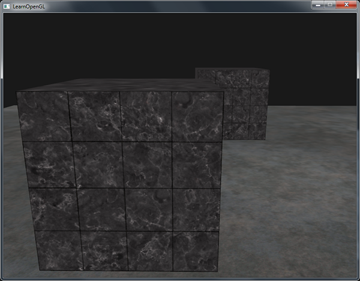
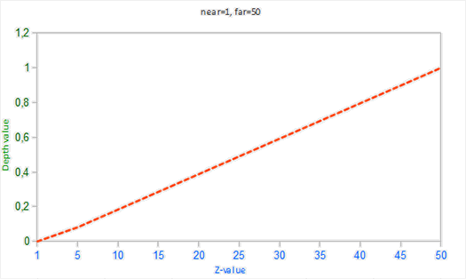
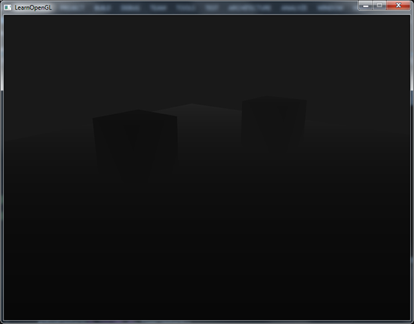
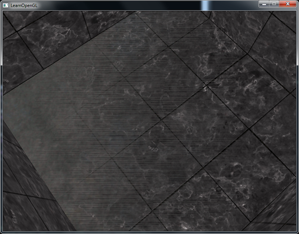

# 深度测试

原文     | [Depth testing](http://learnopengl.com/#!Advanced-OpenGL/Depth-testing)
      ---|---
作者     | JoeyDeVries
翻译     | [Django](http://bullteacher.com/)
校对     | [Geequlim](http://geequlim.com)

在[坐标系的教程](../01 Getting started/08 Coordinate Systems.md)中我们呈现了一个3D容器,使用**深度缓冲(Depth Buffer)**,以防止被其他面遮挡的面渲染到前面。在本教程中我们将细致地讨论被深度缓冲(或z-buffer)所存储的**深度值**以及它是如何确定一个片段是否被其他片段遮挡。

**深度缓冲**就像**颜色缓冲(Color Buffer)**(存储所有的片段颜色:视觉输出)那样存储每个片段的信息，(通常) 和颜色缓冲区有相同的宽度和高度。深度缓冲由窗口系统自动创建并将其深度值存储为 16、 24 或 32 位浮点数。在大多数系统中深度缓冲区为24位。

当深度测试启用的时候， OpenGL 测试深度缓冲区内的深度值。OpenGL 执行深度测试的时候，如果此测试通过，深度缓冲内的值将被设为新的深度值。如果深度测试失败，则丢弃该片段。

深度测试在片段着色器运行之后(并且模板测试运行之后，我们将在[接下来](http://www.learnopengl.com/#!Advanced-OpenGL/Stencil-testing)的教程中讨论)在屏幕空间中执行的。屏幕空间坐标直接有关的视区，由OpenGL的`glViewport`函数给定，并且可以通过GLSL的片段着色器中内置的 `gl_FragCoord`变量访问。`gl_FragCoord` 的 X 和 y 表示该片段的屏幕空间坐标 ((0，0) 在左下角)。`gl_FragCoord` 还包含一个 z 坐标，它包含了片段的实际深度值。此 z 坐标值是与深度缓冲区的内容进行比较的值。

!!! Important

    现在大多数 GPU 都支持一种称为提前深度测试(Early depth testing)的硬件功能。提前深度测试允许深度测试在片段着色器之前运行。明确一个片段永远不会可见的 (它是其它物体的后面) 我们可以更早地放弃该片段。

    片段着色器通常是相当费时的所以我们应该尽量避免运行它们。对片段着色器提前深度测试一个限制是，你不应该写入片段的深度值。如果片段着色器将写入其深度值，提前深度测试是不可能的，OpenGL不能事先知道深度值。

深度测试默认是关闭的，要启用深度测试的话，我们需要用`GL_DEPTH_TEST`选项来打开它：

```c++
glEnable(GL_DEPTH_TEST);
```

一旦启用深度测试，如果片段通过深度测试，OpenGL自动在深度缓冲区存储片段的 z 值，如果深度测试失败，那么相应地丢弃该片段。如果启用深度测试，那么在每个渲染之前还应使用`GL_DEPTH_BUFFER_BIT`清除深度缓冲区，否则深度缓冲区将保留上一次进行深度测试时所写的深度值

```c++
glClear(GL_COLOR_BUFFER_BIT | GL_DEPTH_BUFFER_BIT);
```

在某些情况下我们需要进行深度测试并相应地丢弃片段，但我们不希望更新深度缓冲区，基本上，可以使用一个只读的深度缓冲区；OpenGL允许我们通过将其深度掩码设置为`GL_FALSE`禁用深度缓冲区写入:

```c++
glDepthMask(GL_FALSE);
```

注意这只在深度测试被启用的时候有效。

## 深度测试函数

OpenGL 允许我们修改它深度测试使用的比较运算符(comparison operators)。这样我们能够控制OpenGL通过或丢弃碎片和如何更新深度缓冲区。我们可以通过调用`glDepthFunc`来设置比较运算符 (或叫做深度函数(depth function)):

```c++
glDepthFunc(GL_LESS);
```

该函数接受在下表中列出的几个比较运算符:

运算符|描述
 ----------|------------------
 GL_ALWAYS |永远通过测试
 GL_NEVER  |永远不通过测试
 GL_LESS   |在片段深度值小于缓冲区的深度时通过测试
 GL_EQUAL  |在片段深度值等于缓冲区的深度时通过测试
 GL_LEQUAL |在片段深度值小于等于缓冲区的深度时通过测试
 GL_GREATER |在片段深度值大于缓冲区的深度时通过测试
 GL_NOTEQUAL|在片段深度值不等于缓冲区的深度时通过测试
 GL_GEQUAL |在片段深度值大于等于缓冲区的深度时通过测试

默认情况下使用`GL_LESS`，这将丢弃深度值高于或等于当前深度缓冲区的值的片段。

让我们看看改变深度函数对输出的影响。我们将使用新的代码显示一个由两个带纹理的立方体和带纹理的地板组成的没有光照的基本场景。你可以在这里找到[源代码](http://learnopengl.com/code_viewer.php?code=advanced/depth_testing_func)和其[着色器](http://learnopengl.com/code_viewer.php?code=advanced/depth_testing_func_shaders)代码。

代码中我们将深度函数设为`GL_ALWAYS`:

```c++
glDepthFunc(GL_ALWAYS);
```

这和我们没有启用深度测试得到了相同的行为。深度测试只是简单地通过，所以这样最后绘制的片段就会呈现在之前绘制的片段前面，即使他们应该在前面。由于我们最后绘制地板平面，那么平面的片段会覆盖每个容器的片段:


重新设置到`GL_LESS`给了我们曾经的场景：



## 深度值精度

在深度缓冲区中包含深度值介于`0.0`和`1.0`之间，从观察者看到其内容与场景中的所有对象的 z 值进行了比较。这些视图空间中的 z 值可以在投影平头截体的近平面和远平面之间的任何值。我们因此需要一些方法来转换这些视图空间 z 值到 [0，1] 的范围内，方法之一就是线性将它们转换为 [0，1] 范围内。下面的 (线性) 方程把 z 值转换为 0.0 和 1.0 之间的值 :

$$
\begin{equation} F_{depth} = \frac{z - near}{far - near} \end{equation}
$$

这里far和near是我们用来提供到投影矩阵设置可见视图截锥的远近值 (见[坐标系](../01 Getting started/08 Coordinate Systems.md))。方程带内锥截体的深度值 z，并将其转换到 [0，1] 范围。在下面的图给出 z 值和其相应的深度值的关系:



!!! Important

    注意在物体接近近平面的时候，方程给出的深度值接近0.0，物体接近远平面时，方程给出的深度接近1.0。

然而，在实践中是几乎从来不使用这样的线性深度缓冲区。正确的投影特性的非线性深度方程是和1/z成正比的 。这样基本上做的是在z很近是的高精度和 z 很远的时候的低精度。用几秒钟想一想: 我们真的需要让1000单位远的物体和只有1单位远的物体的深度值有相同的精度吗?线性方程没有考虑这一点。

由于非线性函数是和 1/z 成正比，例如1.0 和 2.0 之间的 z 值，将变为 1.0 到 0.5之间， 这样在z非常小的时候给了我们很高的精度。50.0 和 100.0 之间的 Z 值将只占 2%的浮点数的精度，这正是我们想要的。这类方程，也需要近和远距离考虑，下面给出:

$$
\begin{equation} F_{depth} = \frac{1/z - 1/near}{1/far - 1/near} \end{equation}
$$

如果你不知道这个方程到底怎么回事也不必担心。要记住的重要一点是在深度缓冲区的值不是线性的屏幕空间 (它们在视图空间投影矩阵应用之前是线性)。值为 0.5 在深度缓冲区并不意味着该对象的 z 值是投影平头截体的中间;顶点的 z 值是实际上相当接近近平面!你可以看到 z 值和产生深度缓冲区的值在下列图中的非线性关系:


正如你所看到，一个附近的物体的小的 z 值因此给了我们很高的深度精度。变换 (从观察者的角度) 的 z 值的方程式被嵌入在投影矩阵，所以当我们变换顶点坐标从视图到裁剪，然后到非线性方程应用了的屏幕空间中。如果你好奇的投影矩阵究竟做了什么我建议阅读[这个文章](http://www.songho.ca/opengl/gl_projectionmatrix.html)。

接下来我们看看这个非线性的深度值。

## 深度缓冲区的可视化

我们知道在片段渲染器的内置`gl_FragCoord`向量的 z 值包含那个片段的深度值。如果我们要吧深度值作为颜色输出，那么我们可以在场景中显示的所有片段的深度值。我们可以返回基于片段的深度值的颜色向量:

```c++
void main()
{
    color = vec4(vec3(gl_FragCoord.z), 1.0f);
}  
```

如果再次运行同一程序你可能会发现一切都是白的，它看起来像我们的深度值都是最大值 1.0。那么为什么没有深度值接近 0.0而发暗?

你可能还记得从上一节中的屏幕空间的深度值是非线性如他们在z很小的时候有很高的精度，，较大的 z 值有较低的精度。该片段的深度值会迅速增加，所以几乎所有顶点的深度值接近 1.0。如果我们小心的靠近物体，你最终可能会看到的色彩越来越暗，意味着它们的 z 值越来越小:


这清楚地表明深度值的非线性特性。近的物体相对远的物体对的深度值比对象较大的影响。只移动几英寸就能让暗色完全变亮。

但是我们可以让深度值变换回线性。要实现这一目标我们需要让点应用投影变换逆的逆变换，成为单独的深度值的过程。这意味着我们必须首先重新变换范围 [0，1] 中的深度值为单位化的设备坐标(normalized device coordinates)范围内 [-1，1] (裁剪空间(clip space))。然后，我们想要反转非线性方程 (等式2) 就像在投影矩阵做的那样并将此反转方程应用于所得到的深度值。然后，结果是一个线性的深度值。听起来能行对吗?

首先，我们需要并不太难的 NDC 深度值转换:

```c++
float z = depth * 2.0 - 1.0;
```

然后把我们所得到的 z 值应用逆转换来检索的线性深度值:

```c++
float linearDepth = (2.0 * near) / (far + near - z * (far - near));
```

注意此方程不是方程 2 的精确的逆方程。这个方程从投影矩阵中导出，可以从新使用等式2将他转换为非线性深度值。这个方程也会考虑使用[0，1] 而不是 [near，far]范围内的 z 值 。[math-heavy](http://www.songho.ca/opengl/gl_projectionmatrix.html)为感兴趣的读者阐述了大量详细的投影矩阵的知识;它还表明了方程是从哪里来的。

这不是从投影矩阵推导出的准确公式;这个方程是除以far的结果。深度值的范围一直到far，这作为一个介于 0.0 和 1.0 之间的颜色值并不合适。除以far的值把深度值映射到介于 0.0 和 1.0，更适合用于演示目的。

这个能够将屏幕空间的非线性深度值转变为线性深度值的完整的片段着色器如下所示：

```c++
#version 330 core

out vec4 color;

float LinearizeDepth(float depth)
{
    float near = 0.1;
    float far = 100.0;
    float z = depth * 2.0 - 1.0; // Back to NDC
    return (2.0 * near) / (far + near - z * (far - near));
}

void main()
{
    float depth = LinearizeDepth(gl_FragCoord.z);
    color = vec4(vec3(depth), 1.0f);
}
```

如果现在运行该应用程序，我们得到在距离实际上线性的深度值。尝试移动现场周围看到深度值线性变化

。

颜色主要是黑色的因为深度值线性范围从 0.1 的近平面到 100 的远平面，那里离我们很远。其结果是，我们相对靠近近平面，从而得到较低 (较暗) 的深度值。

## 深度冲突

两个平面或三角形如此紧密相互平行深度缓冲区不具有足够的精度以至于无法得到哪一个靠前。结果是，这两个形状不断似乎切换顺序导致怪异出问题。这被称为**深度冲突(Z-fighting)**，因为它看上去像形状争夺顶靠前的位置。

我们到目前为止一直在使用的场景中有几个地方深度冲突很显眼。容器被置于确切高度地板被安置这意味着容器的底平面与地板平面共面。两个平面的深度值是相同的，因此深度测试也没有办法找出哪个是正确。

如果您移动摄像机到容器的里面，那么这个影响清晰可，容器的底部不断切换容器的平面和地板的平面:



深度冲突是深度缓冲区的普遍问题，当对象的距离越远一般越强(因为深度缓冲区在z值非常大的时候没有很高的精度)。深度冲突还无法完全避免，但有一般的几个技巧，将有助于减轻或完全防止深度冲突在你的场景中的出现：

### 防止深度冲突

第一个也是最重要的技巧是让物体之间不要离得太近，以至于他们的三角形重叠。通过在物体之间制造一点用户无法察觉到的偏移，可以完全解决深度冲突。在容器和平面的条件下，我们可以把容器像+y方向上略微移动。这微小的改变可能完全不被注意但是可以有效地减少或者完全解决深度冲突。然而这需要人工的干预每个物体，并进行彻底地测试，以确保这个场景的物体之间没有深度冲突。

另一个技巧是尽可能把近平面设置得远一些。前面我们讨论过越靠近近平面的位置精度越高。所以我们移动近平面远离观察者，我们可以在椎体内很有效的提高精度。然而把近平面移动的太远会导致近处的物体被裁剪掉。所以不断调整测试近平面的值，为你的场景找出最好的近平面的距离。

另外一个技巧是放弃一些性能来得到更高的深度值的精度。大多数的深度缓冲区都是24位。但现在显卡支持32位深度值，这让深度缓冲区的精度提高了一大节。所以牺牲一些性能你会得到更精确的深度测试，减少深度冲突。

我们已经讨论过的 3 个技术是最常见和容易实现消除深度冲突的技术。还有一些其他技术需要更多的工作，仍然不会完全消除深度冲突。深度冲突是一个常见的问题，但如果你将列举的技术适当结合你可能不会真的需要处理深度冲突。