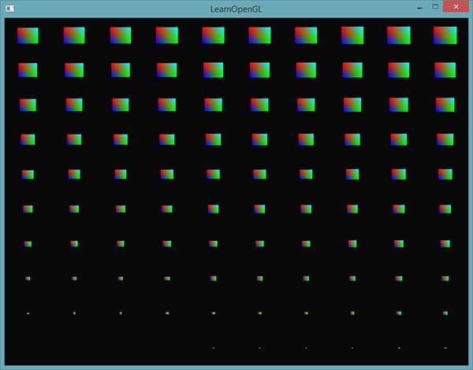
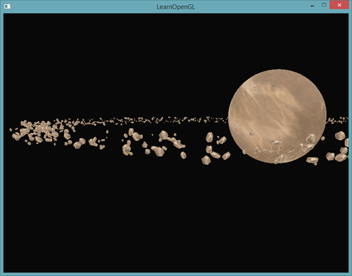
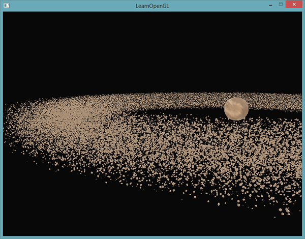

# 实例化

原文     | [Instancing](http://learnopengl.com/#!Advanced-OpenGL/Instancing)
      ---|---
作者     | JoeyDeVries
翻译     | Meow J
校对     | 暂未校对

假设你有一个绘制了很多模型的场景，而大部分的模型包含的是同一组顶点数据，只不过进行的是不同的世界空间变换。想象一个充满草的场景：每根草都是一个包含几个三角形的小模型。你可能会需要绘制很多根草，最终在每帧中你可能会需要渲染上千或者上万根草。因为每一根草仅仅是由几个三角形构成，渲染几乎是瞬间完成的，但上千个渲染函数调用却会极大地影响性能。

如果我们需要渲染大量物体时，代码看起来会像这样：

```c++
for(unsigned int i = 0; i < amount_of_models_to_draw; i++)
{
    DoSomePreparations(); // 绑定VAO，绑定纹理，设置uniform等
    glDrawArrays(GL_TRIANGLES, 0, amount_of_vertices);
}
```

如果像这样绘制模型的大量<def>实例</def>(Instance)，你很快就会因为绘制调用过多而达到性能瓶颈。与绘制顶点本身相比，使用<fun>glDrawArrays</fun>或<fun>glDrawElements</fun>函数告诉GPU去绘制你的顶点数据会消耗更多的性能，因为OpenGL在绘制顶点数据之前需要做很多准备工作（比如告诉GPU该从哪个缓冲读取数据，从哪寻找顶点属性，而且这些都是在相对缓慢的CPU到GPU总线(CPU to GPU Bus)上进行的）。所以，即便渲染顶点非常快，命令GPU去渲染却未必。

如果我们能够将数据一次性发送给GPU，然后使用一个绘制函数让OpenGL利用这些数据绘制多个物体，就会更方便了。这就是<def>实例化</def>(Instancing)。

实例化这项技术能够让我们使用一个渲染调用来绘制多个物体，来节省每次绘制物体时CPU -> GPU的通信，它只需要一次即可。如果想使用实例化渲染，我们只需要将<fun>glDrawArrays</fun>和<fun>glDrawElements</fun>的渲染调用分别改为<fun>glDrawArraysInstanced</fun>和<fun>glDrawElementsInstanced</fun>就可以了。这些渲染函数的**实例化**版本需要一个额外的参数，叫做<def>实例数量</def>(Instance Count)，它能够设置我们需要渲染的实例个数。这样我们只需要将必须的数据发送到GPU一次，然后使用一次函数调用告诉GPU它应该如何绘制这些实例。GPU将会直接渲染这些实例，而不用不断地与CPU进行通信。

这个函数本身并没有什么用。渲染同一个物体一千次对我们并没有什么用处，每个物体都是完全相同的，而且还在同一个位置。我们只能看见一个物体！处于这个原因，GLSL在顶点着色器中嵌入了另一个内建变量，<var>gl_InstanceID</var>。

在使用实例化渲染调用时，<var>gl_InstanceID</var>会从0开始，在每个实例被渲染时递增1。比如说，我们正在渲染第43个实例，那么顶点着色器中它的<var>gl_InstanceID</var>将会是42。因为每个实例都有唯一的ID，我们可以建立一个数组，将ID与位置值对应起来，将每个实例放置在世界的不同位置。

为了体验一下实例化绘制，我们将会在标准化设备坐标系中使用一个渲染调用，绘制100个2D四边形。我们会索引一个包含100个偏移向量的uniform数组，将偏移值加到每个实例化的四边形上。最终的结果是一个排列整齐的四边形网格：


每个四边形由2个三角形所组成，一共有6个顶点。每个顶点包含一个2D的标准化设备坐标位置向量和一个颜色向量。
下面就是这个例子使用的顶点数据，为了大量填充屏幕，每个三角形都很小：

```c++
float quadVertices[] = {
    // 位置          // 颜色
    -0.05f,  0.05f,  1.0f, 0.0f, 0.0f,
     0.05f, -0.05f,  0.0f, 1.0f, 0.0f,
    -0.05f, -0.05f,  0.0f, 0.0f, 1.0f,

    -0.05f,  0.05f,  1.0f, 0.0f, 0.0f,
     0.05f, -0.05f,  0.0f, 1.0f, 0.0f,   
     0.05f,  0.05f,  0.0f, 1.0f, 1.0f		    		
};  
```

片段着色器会从顶点着色器接受颜色向量，并将其设置为它的颜色输出，来实现四边形的颜色：

```c++
#version 330 core
out vec4 FragColor;
  
in vec3 fColor;

void main()
{
    FragColor = vec4(fColor, 1.0);
}
```

到现在都没有什么新内容，但从顶点着色器开始就变得很有趣了：

```c++
#version 330 core
layout (location = 0) in vec2 aPos;
layout (location = 1) in vec3 aColor;

out vec3 fColor;

uniform vec2 offsets[100];

void main()
{
    vec2 offset = offsets[gl_InstanceID];
    gl_Position = vec4(aPos + offset, 0.0, 1.0);
    fColor = aColor;
}
```

这里我们定义了一个叫做<var>offsets</var>的数组，它包含100个偏移向量。在顶点着色器中，我们会使用<var>gl_InstanceID</var>来索引<var>offsets</var>数组，获取每个实例的偏移向量。如果我们要实例化绘制100个四边形，仅使用这个顶点着色器我们就能得到100个位于不同位置的四边形。

当前，我们仍要设置这些偏移位置，我们会在进入渲染循环之前使用一个嵌套for循环计算：

```c++
glm::vec2 translations[100];
int index = 0;
float offset = 0.1f;
for(int y = -10; y < 10; y += 2)
{
    for(int x = -10; x < 10; x += 2)
    {
        glm::vec2 translation;
        translation.x = (float)x / 10.0f + offset;
        translation.y = (float)y / 10.0f + offset;
        translations[index++] = translation;
    }
}
```

这里，我们创建100个位移向量，表示10x10网格上的所有位置。除了生成<var>translations</var>数组之外，我们还需要将数据转移到顶点着色器的uniform数组中：

```c++
shader.use();
for(unsigned int i = 0; i < 100; i++)
{
    stringstream ss;
    string index;
    ss << i; 
    index = ss.str(); 
    shader.setVec2(("offsets[" + index + "]").c_str(), translations[i]);
}
```

在这一段代码中，我们将for循环的计数器<var>i</var>转换为一个<fun>string</fun>，我们可以用它来动态创建位置值的字符串，用于uniform位置值的索引。接下来，我们会对<var>offsets</var> uniform数组中的每一项设置对应的位移向量。

现在所有的准备工作都做完了，我们可以开始渲染四边形了。对于实例化渲染，我们使用<fun>glDrawArraysInstanced</fun>或<fun>glDrawElementsInstanced</fun>。因为我们使用的不是索引缓冲，我们会调用<fun>glDrawArrays</fun>版本的函数：

```c++
glBindVertexArray(quadVAO);
glDrawArraysInstanced(GL_TRIANGLES, 0, 6, 100);
```

<fun>glDrawArraysInstanced</fun>的参数和<fun>glDrawArrays</fun>完全一样，除了最后多了个参数用来设置需要绘制的实例数量。因为我们想要在10x10网格中显示100个四边形，我们将它设置为100.运行代码之后，你应该能得到熟悉的100个五彩的四边形。

## 实例化数组

虽然之前的实现在目前的情况下能够正常工作，但是如果我们要渲染远超过100个实例的时候（这其实非常普遍），我们最终会超过最大能够发送至着色器的uniform数据大小[上限](http://www.opengl.org/wiki/Uniform_(GLSL)#Implementation_limits)。它的一个代替方案是<def>实例化数组</def>(Instanced Array)，它被定义为一个顶点属性（能够让我们储存更多的数据），仅在顶点着色器渲染一个新的实例时才会更新。

使用顶点属性时，顶点着色器的每次运行都会让GLSL获取新一组适用于当前顶点的属性。而当我们将顶点属性定义为一个实例化数组时，顶点着色器就只需要对每个实例，而不是每个顶点，更新顶点属性的内容了。这允许我们对逐顶点的数据使用普通的顶点属性，而对逐实例的数据使用实例化数组。

为了给你一个实例化数组的例子，我们将使用之前的例子，并将偏移量uniform数组设置为一个实例化数组。我们需要在顶点着色器中再添加一个顶点属性：

```c++
#version 330 core
layout (location = 0) in vec2 aPos;
layout (location = 1) in vec3 aColor;
layout (location = 2) in vec2 aOffset;

out vec3 fColor;

void main()
{
    gl_Position = vec4(aPos + aOffset, 0.0, 1.0);
    fColor = aColor;
}
```

我们不再使用<var>gl_InstanceID</var>，现在不需要索引一个uniform数组就能够直接使用<var>offset</var>属性了。

因为实例化数组和<var>position</var>与<var>color</var>变量一样，都是顶点属性，我们还需要将它的内容存在顶点缓冲对象中，并且配置它的属性指针。我们首先将（上一部分的）<var>translations</var>数组存到一个新的缓冲对象中：

```c++
unsigned int instanceVBO;
glGenBuffers(1, &instanceVBO);
glBindBuffer(GL_ARRAY_BUFFER, instanceVBO);
glBufferData(GL_ARRAY_BUFFER, sizeof(glm::vec2) * 100, &translations[0], GL_STATIC_DRAW);
glBindBuffer(GL_ARRAY_BUFFER, 0);
```

之后我们还需要设置它的顶点属性指针，并启用顶点属性：

```c++
glEnableVertexAttribArray(2);
glBindBuffer(GL_ARRAY_BUFFER, instanceVBO);
glVertexAttribPointer(2, 2, GL_FLOAT, GL_FALSE, 2 * sizeof(float), (void*)0);
glBindBuffer(GL_ARRAY_BUFFER, 0);	
glVertexAttribDivisor(2, 1);
```

这段代码很有意思的地方在于最后一行，我们调用了<fun>glVertexAttribDivisor</fun>。这个函数告诉了OpenGL该**什么时候**更新顶点属性的内容至新一组数据。它的第一个参数是需要的顶点属性，第二个参数是属性除数(Attribute Divisor)。默认情况下，属性除数是0，告诉OpenGL我们需要在顶点着色器的每次迭代时更新顶点属性。将它设置为1时，我们告诉OpenGL我们希望在渲染一个新实例的时候更新顶点属性。而设置为2时，我们希望每2个实例更新一次属性，以此类推。我们将属性除数设置为1，是在告诉OpenGL，处于位置值2的顶点属性是一个实例化数组。

如果我们现在使用<fun>glDrawArraysInstanced</fun>，再次渲染四边形，会得到以下输出：


这和之前的例子是完全一样的，但这次是使用实例化数组实现的，这让我们能够传递更多的数据到顶点着色器（只要内存允许）来用于实例化绘制。

为了更有趣一点，我们也可以使用<var>gl_InstanceID</var>，从右上到左下逐渐缩小四边形：

```c++
void main()
{
    vec2 pos = aPos * (gl_InstanceID / 100.0);
    gl_Position = vec4(pos + aOffset, 0.0, 1.0);
    fColor = aColor;
}
```

结果就是，第一个四边形的实例会非常小，随着绘制实例的增加，<var>gl_InstanceID</var>会越来越接近100，四边形也就越来越接近原始大小。像这样将实例化数组与<var>gl_InstanceID</var>结合使用是完全可行的。



如果你还是不确定实例化渲染是如何工作的，或者想看看所有代码是如何组合起来的，你可以在[这里](https://learnopengl.com/code_viewer_gh.php?code=src/4.advanced_opengl/10.1.instancing_quads/instancing_quads.cpp)找到程序的源代码。

虽然很有趣，但是这些例子并不是实例化的好例子。是的，它们的确让你知道实例化是怎么工作的，但是我们还没接触到它最有用的一点：绘制巨大数量的相似物体。出于这个原因，我们将会在下一部分进入太空探险，见识实例化渲染真正的威力。

# 小行星带

想象这样一个场景，在宇宙中有一个大的行星，它位于小行星带的中央。这样的小行星带可能包含成千上万的岩块，在很不错的显卡上也很难完成这样的渲染。实例化渲染正是适用于这样的场景，因为所有的小行星都可以使用一个模型来表示。每个小行星可以再使用不同的变换矩阵来进行少许的变化。

为了展示实例化渲染的作用，我们首先会**不使用**实例化渲染，来渲染小行星绕着行星飞行的场景。这个场景将会包含一个大的行星模型，它可以在[这里](../data/planet.rar)下载，以及很多环绕着行星的小行星。小行星的岩石模型可以在[这里](../data/rock.rar)下载。

在代码例子中，我们将使用在[模型加载](../03 Model Loading/01 Assimp.md)小节中定义的模型加载器来加载模型。

为了得到想要的效果，我们将会为每个小行星生成一个变换矩阵，用作它们的模型矩阵。变换矩阵首先将小行星位移到小行星带中的某处，我们还会加一个小的随机偏移值到这个偏移量上，让这个圆环看起来更自然一点。接下来，我们应用一个随机的缩放，并且以一个旋转向量为轴进行一个随机的旋转。最终的变换矩阵不仅能将小行星变换到行星的周围，而且会让它看起来更自然，与其它小行星不同。最终的结果是一个布满小行星的圆环，其中每一个小行星都与众不同。

```c++
unsigned int amount = 1000;
glm::mat4 *modelMatrices;
modelMatrices = new glm::mat4[amount];
srand(glfwGetTime()); // 初始化随机种子	
float radius = 50.0;
float offset = 2.5f;
for(unsigned int i = 0; i < amount; i++)
{
    glm::mat4 model;
    // 1. 位移：分布在半径为 'radius' 的圆形上，偏移的范围是 [-offset, offset]
    float angle = (float)i / (float)amount * 360.0f;
    float displacement = (rand() % (int)(2 * offset * 100)) / 100.0f - offset;
    float x = sin(angle) * radius + displacement;
    displacement = (rand() % (int)(2 * offset * 100)) / 100.0f - offset;
    float y = displacement * 0.4f; // 让行星带的高度比x和z的宽度要小
    displacement = (rand() % (int)(2 * offset * 100)) / 100.0f - offset;
    float z = cos(angle) * radius + displacement;
    model = glm::translate(model, glm::vec3(x, y, z));

    // 2. 缩放：在 0.05 和 0.25f 之间缩放
    float scale = (rand() % 20) / 100.0f + 0.05;
    model = glm::scale(model, glm::vec3(scale));

    // 3. 旋转：绕着一个（半）随机选择的旋转轴向量进行随机的旋转
    float rotAngle = (rand() % 360);
    model = glm::rotate(model, rotAngle, glm::vec3(0.4f, 0.6f, 0.8f));

    // 4. 添加到矩阵的数组中
    modelMatrices[i] = model;
}  
```

这段代码看起来可能有点吓人，但我们只是将小行星的`x`和`z`位置变换到了一个半径为<var>radius</var>的圆形上，并且在半径的基础上偏移了<var>-offset</var>到<var>offset</var>。我们让`y`偏移的影响更小一点，让小行星带更扁平一点。接下来，我们应用了缩放和旋转变换，并将最终的变换矩阵储存在<var>modelMatrices</var>中，这个数组的大小是<var>amount</var>。这里，我们一共生成1000个模型矩阵，每个小行星一个。

在加载完行星和岩石模型，并编译完着色器之后，渲染的代码看起来是这样的：

```c++
// 绘制行星
shader.use();
glm::mat4 model;
model = glm::translate(model, glm::vec3(0.0f, -3.0f, 0.0f));
model = glm::scale(model, glm::vec3(4.0f, 4.0f, 4.0f));
shader.setMat4("model", model);
planet.Draw(shader);
  
// 绘制小行星
for(unsigned int i = 0; i < amount; i++)
{
    shader.setMat4("model", modelMatrices[i]);
    rock.Draw(shader);
}  
```

我们首先绘制了行星的模型，并对它进行位移和缩放，以适应场景，接下来，我们绘制<var>amount</var>数量的岩石模型。在绘制每个岩石之前，我们首先需要在着色器内设置对应的模型变换矩阵。

最终的结果是一个看起来像是太空的场景，环绕着行星的是看起来很自然的小行星带：



这个场景每帧包含1001次渲染调用，其中1000个是岩石模型。你可以在[这里](https://learnopengl.com/code_viewer_gh.php?code=src/4.advanced_opengl/10.2.asteroids/asteroids.cpp)找到源代码。

当我们开始增加这个数字的时候，你很快就会发现场景不再能够流畅运行了，帧数也下降很厉害。当我们将<var>amount</var>设置为2000的时候，场景就已经慢到移动都很困难的程度了。

现在，我们来尝试使用实例化渲染来渲染相同的场景。我们首先对顶点着色器进行一点修改：

```c++
#version 330 core
layout (location = 0) in vec3 aPos;
layout (location = 2) in vec2 aTexCoords;
layout (location = 3) in mat4 instanceMatrix;

out vec2 TexCoords;

uniform mat4 projection;
uniform mat4 view;

void main()
{
    gl_Position = projection * view * instanceMatrix * vec4(aPos, 1.0); 
    TexCoords = aTexCoords;
}
```

我们不再使用模型uniform变量，改为一个<fun>mat4</fun>的顶点属性，让我们能够存储一个实例化数组的变换矩阵。然而，当我们顶点属性的类型大于<fun>vec4</fun>时，就要多进行一步处理了。顶点属性最大允许的数据大小等于一个<fun>vec4</fun>。因为一个<fun>mat4</fun>本质上是4个<fun>vec4</fun>，我们需要为这个矩阵预留4个顶点属性。因为我们将它的位置值设置为3，矩阵每一列的顶点属性位置值就是3、4、5和6。

接下来，我们需要为这4个顶点属性设置属性指针，并将它们设置为实例化数组：

```c++
// 顶点缓冲对象
unsigned int buffer;
glGenBuffers(1, &buffer);
glBindBuffer(GL_ARRAY_BUFFER, buffer);
glBufferData(GL_ARRAY_BUFFER, amount * sizeof(glm::mat4), &modelMatrices[0], GL_STATIC_DRAW);
  
for(unsigned int i = 0; i < rock.meshes.size(); i++)
{
    unsigned int VAO = rock.meshes[i].VAO;
    glBindVertexArray(VAO);
    // 顶点属性
    GLsizei vec4Size = sizeof(glm::vec4);
    glEnableVertexAttribArray(3); 
    glVertexAttribPointer(3, 4, GL_FLOAT, GL_FALSE, 4 * vec4Size, (void*)0);
    glEnableVertexAttribArray(4); 
    glVertexAttribPointer(4, 4, GL_FLOAT, GL_FALSE, 4 * vec4Size, (void*)(vec4Size));
    glEnableVertexAttribArray(5); 
    glVertexAttribPointer(5, 4, GL_FLOAT, GL_FALSE, 4 * vec4Size, (void*)(2 * vec4Size));
    glEnableVertexAttribArray(6); 
    glVertexAttribPointer(6, 4, GL_FLOAT, GL_FALSE, 4 * vec4Size, (void*)(3 * vec4Size));

    glVertexAttribDivisor(3, 1);
    glVertexAttribDivisor(4, 1);
    glVertexAttribDivisor(5, 1);
    glVertexAttribDivisor(6, 1);

    glBindVertexArray(0);
}  
```

注意这里我们将<fun>Mesh</fun>的<var>VAO</var>从私有变量改为了公有变量，让我们能够访问它的顶点数组对象。这并不是最好的解决方案，只是为了配合本小节的一个简单的改动。除此之外代码就应该很清楚了。我们告诉了OpenGL应该如何解释每个缓冲顶点属性的缓冲，并且告诉它这些顶点属性是实例化数组。

接下来，我们再次使用网格的<var>VAO</var>，这一次使用<fun>glDrawElementsInstanced</fun>进行绘制：

```c++
// 绘制小行星
instanceShader.use();
for(unsigned int i = 0; i < rock.meshes.size(); i++)
{
    glBindVertexArray(rock.meshes[i].VAO);
    glDrawElementsInstanced(
        GL_TRIANGLES, rock.meshes[i].indices.size(), GL_UNSIGNED_INT, 0, amount
    );
}
```

这里，我们绘制与之前相同数量<var>amount</var>的小行星，但是使用的是实例渲染。结果应该是非常相似的，但如果你开始增加<var>amount</var>变量，你就能看见实例化渲染的效果了。没有实例化渲染的时候，我们只能流畅渲染1000到1500个小行星。而使用了实例化渲染之后，我们可以将这个值设置为100000，每个岩石模型有576个顶点，每帧加起来大概要绘制5700万个顶点，但性能却没有受到任何影响！



上面这幅图渲染了10万个小行星，半径为`150.0f`，偏移量等于`25.0f`。你可以在[这里](https://learnopengl.com/code_viewer_gh.php?code=src/4.advanced_opengl/10.3.asteroids_instanced/asteroids_instanced.cpp)找到实例化渲染的代码。

!!! Important

	在某些机器上，10万个小行星可能会太多了，所以尝试修改这个值，直到达到一个你能接受的帧率。

可以看到，在合适的环境下，实例化渲染能够大大增加显卡的渲染能力。正是出于这个原因，实例化渲染通常会用于渲染草、植被、粒子，以及上面这样的场景，基本上只要场景中有很多重复的形状，都能够使用实例化渲染来提高性能。