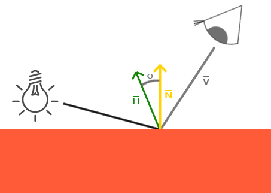
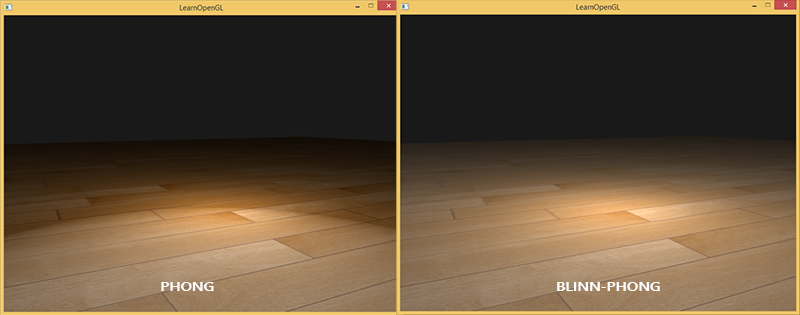

# 高级光照

原文     | [Advanced Lighting](http://learnopengl.com/#!Advanced-Lighting/Advanced-Lighting)
      ---|---
作者     | JoeyDeVries
翻译     | [Django](http://bullteacher.com/)
校对     | gjy_1992

在光照教程中，我们简单的介绍了Phong光照模型，它给我们的场景带来的基本的现实感。Phong模型看起来还不错，但本章我们把重点放在一些细微差别上。

## Blinn-Phong

Phong光照很棒，而且性能较高，但是它的镜面反射在某些条件下会失效，特别是当发光值属性低的时候，对应一个非常大的粗糙的镜面区域。下面的图片展示了，当我们使用镜面的发光值为1.0时，一个带纹理地板的效果：


你可以看到，镜面区域边缘迅速减弱并截止。出现这个问题的原因是在视线向量和反射向量的角度不允许大于90度。如果大于90度的话，点乘的结果就会是负数，镜面的贡献成分就会变成0。你可能会想，这不是一个问题，因为大于90度时我们不应看到任何光，对吧？

错了，这只适用于漫散射部分，当法线和光源之间的角度大于90度时意味着光源在被照亮表面的下方，这样光的散射成分就会是0.0。然而，对于镜面光照，我们不会测量光源和法线之间的角度，而是测量视线和反射方向向量之间的。看看下面的两幅图：


现在看来问题就很明显了。左侧图片显示Phong反射的θ小于90度的情况。我们可以看到右侧图片视线和反射之间的角θ大于90度，这样镜面反射成分将会被消除。通常这也不是问题，因为视线方向距离反射方向很远，但如果我们使用一个数值较低的发光值参数的话，镜面半径就会足够大，以至于能够贡献一些镜面反射的成份了。在例子中，我们在角度大于90度时消除了这个贡献（如第一个图片所示）。

1977年James F. Blinn引入了Blinn-Phong着色，它扩展了我们目前所使用的Phong着色。Blinn-Phong模型很大程度上和Phong是相似的，不过它稍微改进了Phong模型，使之能够克服我们所讨论到的问题。它放弃使用反射向量，而是基于我们现在所说的一个叫做半程向量（halfway vector）的向量，这是个单位向量，它在视线方向和光线方向的中间。半程向量和表面法线向量越接近，镜面反射成份就越大。



当视线方向恰好与反射向量对称时，半程向量就与法线向量重合。这样观察者距离原来的反射方向越近，镜面反射的高光就会越强。

这里，你可以看到无论观察者往哪里看，半程向量和表面法线之间的夹角永远都不会超过90度（当然除了光源远远低于表面的情况）。这样会产生和Phong反射稍稍不同的结果，但这时看起来会更加可信，特别是发光值参数比较低的时候。Blinn-Phong着色模型也正是早期OpenGL固定函数输送管道（fixed function pipeline）所使用的着色模型。

得到半程向量很容易，我们将光的方向向量和视线向量相加，然后将结果归一化（normalize）；

$$
\(\bar{H} = \frac{\bar{L} + \bar{V}}{||\bar{L} + \bar{V}||}\)
$$

翻译成GLSL代码如下：

```c++
vec3 lightDir = normalize(lightPos - FragPos);
vec3 viewDir = normalize(viewPos - FragPos);
vec3 halfwayDir = normalize(lightDir + viewDir);
```

实际的镜面反射的计算，就成为计算表面法线和半程向量的点乘，并对其结果进行约束（大于或等于0），然后获取它们之间角度的余弦，再添加上发光值参数：

```c++
float spec = pow(max(dot(normal, halfwayDir), 0.0), shininess);
vec3 specular = lightColor * spec;
```

除了我们刚刚讨论的，Blinn-Phong没有更多的内容了。Blinn-Phong和Phong的镜面反射唯一不同之处在于，现在我们要测量法线和半程向量之间的角度，而半程向量是视线方向和反射向量之间的夹角。

!!! Important
    
    Blinn-Phong着色的一个附加好处是，它比Phong着色性能更高，因为我们不必计算更加复杂的反射向量了。

引入了半程向量来计算镜面反射后，我们再也不会遇到Phong着色的骤然截止问题了。下图展示了两种不同方式下发光值指数为0.5时镜面区域的不同效果：



Phong和Blinn-Phong着色之间另一个细微差别是，半程向量和表面法线之间的角度经常会比视线和反射向量之间的夹角更小。结果就是，为了获得和Phong着色相似的效果，必须把发光值参数设置的大一点。通常的经验是将其设置为Phong着色的发光值参数的2至4倍。

下图是Phong指数为8.0和Blinn-Phong指数为32的时候，两种specular反射模型的对比：


你可以看到Blinn-Phong的镜面反射成分要比Phong锐利一些。这通常需要使用一点小技巧才能获得之前你所看到的Phong着色的效果，但Blinn-Phong着色的效果比默认的Phong着色通常更加真实一些。

这里我们用到了一个简单像素着色器，它可以在普通Phong反射和Blinn-Phong反射之间进行切换：

```c++
void main()
{
    [...]
    float spec = 0.0;
    if(blinn)
    {
        vec3 halfwayDir = normalize(lightDir + viewDir);  
        spec = pow(max(dot(normal, halfwayDir), 0.0), 16.0);
    }
    else
    {
        vec3 reflectDir = reflect(-lightDir, normal);
        spec = pow(max(dot(viewDir, reflectDir), 0.0), 8.0);
    }
``` 

你可以在这里找到这个简单的[demo的源码](http://www.learnopengl.com/code_viewer.php?code=advanced-lighting/blinn_phong)以及[顶点](http://www.learnopengl.com/code_viewer.php?code=advanced-lighting/blinn_phong&type=vertex)和[片段](http://www.learnopengl.com/code_viewer.php?code=advanced-lighting/blinn_phong&type=fragment)着色器。按下b键，这个demo就会从Phong切换到Blinn-Phong光照，反之亦然。

