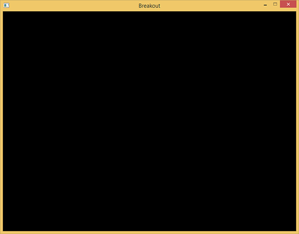

# 准备工作

原文     | [Setting up](http://learnopengl.com/#!In-Practice/2D-Game/Setting-up)
      ---|---
作者     | JoeyDeVries
翻译     | [ZMANT](https://github.com/Itanq)
校对     | 暂无

在开始真正写游戏机制之前，我们首先需要配置一个简单的框架，用来存放这个游戏，这个游戏将会用到几个第三方库，它们的大多数都已经在前面的教程中介绍过了。在需要用到新的库的时候，我会作出适当的介绍。

首先，我们定义一个所谓的<def>超级</def>(Uber)游戏类，它会包含所有相关的渲染和游戏代码。这个游戏类的主要作用是（简单）管理你的游戏代码，并与此同时将所有的窗口代码从游戏中解耦。这样子的话，你就可以把相同的类迁移到完全不同的窗口库（比如SDL或SFML）而不需要做太多的工作。

!!! important

	抽象并归纳游戏或图形代码至类与对象中有成千上万种方式。在这个系列教程中你所看到的仅是其中的一种。如果你觉得能有更好的方式进行实现，你可以尝试改进我的这个实现。

这个游戏类封装了一个初始化函数、一个更新函数、一个处理输入函数以及一个渲染函数：

```c++
class Game
{
    public:
        // 游戏状态
        GameState  State;	
        GLboolean  Keys[1024];
        GLuint	   Width, Height;
        // 构造函数/析构函数
        Game(GLuint width, GLuint height);
        ~Game();
        // 初始化游戏状态（加载所有的着色器/纹理/关卡）
        void Init();
        // 游戏循环
        void ProcessInput(GLfloat dt);
        void Update(GLfloat dt);
        void Render();
};
```

这个类应该包含了所有在一个游戏类中会出现的东西。我们通过给定一个宽度和高度（对应于你玩游戏时的分辨率）来初始化这个游戏，并且使用<fun>Init</fun>函数来加载着色器、纹理并且初始化所有的游戏状态。我们可以通过调用<fun>ProcessInput</fun>函数，并使用存储在<var>Keys</var>数组里的数据来处理输入。并且在<fun>Update</fun>函数里面我们可以更新游戏设置状态（比如玩家/球的移动）。最后，我们还可以调用<fun>Render</fun>函数来对游戏进行渲染。注意，我们将运动逻辑与渲染逻辑分开了。

这个<fun>Game</fun>类同样了封装了一个叫做<var>State</var>的变量，它的类型是<def>GameState</def>，定义如下：

```c++
// 代表了游戏的当前状态
enum GameState {
    GAME_ACTIVE,
    GAME_MENU,
    GAME_WIN
}; 
```

这个类可以帮助我们跟踪游戏的当前状态。这样的话我们就可以根据当前游戏的状态来决定渲染和/或者处理不同的元素(Item)了（比如当我们在游戏菜单界面的时候就可能需要渲染和处理不同的元素了）。

目前为止，这个游戏类的函数还完全是空的，因为我们还没有写游戏的实际代码，但这里是`Game`类的[头文件](http://learnopengl.com/code_viewer.php?code=in-practice/breakout/game_setting-up.h)和[代码文件](http://learnopengl.com/code_viewer.php?code=in-practice/breakout/game_setting-up)。

## 工具类

因为我们正在开发一个大型应用，所以我们将不得不频繁地重用一些OpenGL的概念，比如纹理和着色器等。因此，为这两个元素创建一个更加易用的接口也是情理之中的事了，就像在我们前面教程中创建的那个着色器类一样。

着色器类会接受两个或三个（如果有几何着色器）字符串，并生成一个编译好的着色器（如果失败的话则生成错误信息）。这个着色器类也包含很多工具(Utility)函数来帮助快速设置uniform值。纹理类会接受一个字节(Byte)数组以及宽度和高度，并（根据设定的属性）生成一个2D纹理图像。同样，这个纹理类也会封装一些工具函数。

我们并不会深入讨论这些类的实现细节，因为学到这里你应该可以很容易地理解它们是如何工作的了。出于这个原因，你可以在下面找到它们的头文件和代码文件，都有详细的注释：

- **着色器**：[头文件](http://learnopengl.com/code_viewer.php?code=in-practice/breakout/shader.h)，[代码](http://learnopengl.com/code_viewer.php?code=in-practice/breakout/shader)
- **纹理**：[头文件](http://learnopengl.com/code_viewer.php?code=in-practice/breakout/texture.h)，[代码](http://learnopengl.com/code_viewer.php?code=in-practice/breakout/texture)

注意当前的纹理类仅是为2D纹理设计的，但你很容易就可以将其扩张至更多的纹理类型。

## 资源管理

尽管着色器与纹理类的函数本身就很棒了，它们仍需要有一个字节数组或一些字符串来调用它们。我们可以很容易将文件加载代码嵌入到它们自己的类中，但这稍微有点违反了<def>单一功能原则</def>(Single Responsibility Principle)，即这两个类应当分别仅仅关注纹理或者着色器本身，而不是它们的文件加载机制。

出于这个原因，我们通常会用一个更加有组织的方法（译注：来实现文件的加载），就是创建一个所谓<def>资源管理器</def>的实体，专门加载游戏相关的资源。创建一个资源管理器有多种方法。在这个教程中我们选择使用一个单一实例(Singleton)的静态资源管理器，（由于它静态的本质）它在整个工程中都可以使用，它会封装所有的已加载资源以及一些相关的加载功能。

使用一个具有静态属性的单一实例类有很多优点也有很多缺点。它主要的缺点就是这样会损失OOP属性，并且丧失构造与析构的控制。不过，对于我们这种小项目来说是这些问题也是很容易处理的。

和其它类的文件一样，这个资源管理器的代码如下：

- **资源管理器**：[头文件](http://learnopengl.com/code_viewer.php?code=in-practice/breakout/resource_manager.h)，[代码](http://learnopengl.com/code_viewer.php?code=in-practice/breakout/resource_manager)

通过使用资源管理器，我们可以很容易地把着色器加载到程序里面：

```c++
Shader shader = ResourceManager::LoadShader("vertex.vs", "fragment.vs", nullptr, "test");
// 接下来使用它
shader.Use();
// 或者
ResourceManager::GetShader("test").Use();
```

<fun>Game</fun>类、资源管理器类，以及很容易管理的<fun>Shader</fun>和<fun>Texture2D</fun>类一起组成了之后教程的基础，我们之后会广泛使用这些类来实现我们的Breakout游戏。

## 程序

我们仍然需要为这个游戏创建一个窗口并且设置一些OpenGL的初始状态。我们确保使用OpenGL的[面剔除](../../04 Advanced OpenGL/04 Face culling.md)功能和[混合](../../04 Advanced OpenGL/03 Blending.md)功能。我们不需要使用深度测试，因为这个游戏完全是2D的，所有顶点都有相同的z值，所以开启深度测试并没有什么用，反而可能造成深度冲突(Z-fighting)。

这个Breakout游戏的起始代码非常简单：我们用GLFW创建一个窗口，注册一些回调函数，创建一个Game对象，并将所有相关的信息都传到游戏类中。代码如下：

- **程序**：[代码](http://learnopengl.com/code_viewer.php?code=in-practice/breakout/program)

运行这个代码，你应该能得到下面的输出：



现在我们已经为之后的教程构建了一个坚实的框架，我们将不断地拓展这个游戏类，封装新的功能。如果你准备好了，就可以开始[下一节](03 Rendering Sprites.md)的学习了。